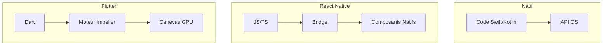

# 1-1-1 Présentation de l'écosystème : Flutter vs React Native vs Natif

Pour choisir une stratégie de développement mobile, il est nécessaire de comprendre comment chaque approche interagit avec le système d'exploitation (OS) et le matériel.

## 1. Comparatif des approches techniques

Le choix entre ces technologies repose sur la manière dont le code est exécuté et rendu à l'écran.

| Caractéristique | Natif (Swift/Kotlin) | React Native | Flutter |
| :--- | :--- | :--- | :--- |
| **Langage** | Swift / Kotlin | JavaScript / TypeScript | Dart |
| **Rendu** | Composants natifs de l'OS | Composants natifs via un "Bridge" | Moteur graphique propre (Skia/Impeller) |
| **Performance** | Maximale | Bonne (dépend du Bridge) | Excellente (compilé en code machine) |
| **UI** | Identique à l'OS | Proche du natif | Dessinée pixel par pixel |

### Fonctionnement détaillé

#### Natif
Le code accède directement aux API de l'OS. Il n'y a aucune couche d'abstraction. C'est l'approche la plus performante pour les applications nécessitant un accès intensif au matériel (Bluetooth, capteurs complexes, traitement vidéo).

#### React Native
Le code JavaScript communique avec les composants natifs via un "pont" (Bridge). Chaque interaction utilisateur doit traverser ce pont, ce qui peut créer des goulots d'étranglement lors d'animations complexes ou de calculs intensifs.

#### Flutter
Flutter utilise son propre moteur de rendu (Impeller). Il ne demande pas à l'OS de dessiner un bouton : il dessine lui-même le bouton sur un canevas. Cela garantit une cohérence visuelle totale sur toutes les versions d'Android et d'iOS.

## 2. Cas d'usage professionnels

### Développement Natif
*   **Exemple :** Application de montage vidéo haute performance ou jeu 3D complexe.
*   **Pourquoi :** Accès direct aux API de bas niveau et gestion fine de la mémoire.

### React Native
*   **Exemple :** Application de e-commerce ou réseau social interne.
*   **Pourquoi :** Réutilisation des compétences d'une équipe web (React) et écosystème de bibliothèques JavaScript mature.

### Flutter
*   **Exemple :** Application bancaire ou outil métier multiplateforme (Mobile, Web, Desktop).
*   **Pourquoi :** Besoin d'une identité visuelle forte et identique sur toutes les plateformes, avec une performance proche du natif.

## 3. Points de vigilance et bonnes pratiques

### Erreurs fréquentes à éviter
*   **Vouloir tout partager :** Essayer de partager 100% du code entre mobile et web. Bien que Flutter le permette, les contraintes UX diffèrent (clavier physique vs tactile, navigation).
*   **Ignorer les spécificités de l'OS :** Même avec Flutter, une application doit respecter les conventions de design (Material Design pour Android, Cupertino pour iOS).

### Recommandations
*   **Évaluation des besoins :** Si l'application nécessite des mises à jour fréquentes de l'UI sans mise à jour de l'App Store, React Native (via CodePush) offre un avantage.
*   **Performance :** Pour des interfaces fluides à 60/120 FPS, Flutter est actuellement la solution multiplateforme la plus robuste grâce à sa compilation AOT (Ahead-of-Time).
*   **Maintenance :** Dart est un langage fortement typé, ce qui réduit drastiquement le nombre de bugs à l'exécution par rapport à JavaScript.

## 4. Synthèse pour le choix technologique

1.  **Performance brute :** Natif.
2.  **Vitesse de développement & Écosystème Web :** React Native.
3.  **Cohérence visuelle & Performance multiplateforme :** Flutter.

## Sources
*   [Flutter Documentation - Architectural Overview](https://docs.flutter.dev/resources/architectural-overview)
*   [React Native Documentation - Architecture](https://reactnative.dev/docs/architecture-overview)