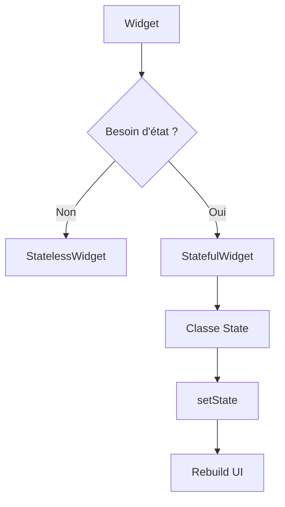

# 1-1-3 Concepts fondamentaux : Widgets Stateless vs Stateful

Dans Flutter, tout est widget. L'interface utilisateur est une arborescence de widgets qui décrivent la configuration de l'UI. La distinction entre `StatelessWidget` et `StatefulWidget` est le fondement de la gestion de l'affichage.

## 1. StatelessWidget : L'affichage immuable

Un `StatelessWidget` est un widget qui ne change pas au cours de la durée de vie de l'application. Il ne dépend que des paramètres reçus lors de sa création (ses `properties`).

*   **Fonctionnement :** Il est construit une seule fois. Si ses paramètres changent, le widget est détruit et reconstruit avec de nouvelles valeurs.
*   **Cas d'usage :** Icônes, textes statiques, boutons de navigation simples, éléments de mise en page (padding, colonnes).

```dart
class SimpleLabel extends StatelessWidget {
  final String text;
  const SimpleLabel({super.key, required this.text});

  @override
  Widget build(BuildContext context) {
    return Text(text);
  }
}
```

## 2. StatefulWidget : La gestion de l'état dynamique

Un `StatefulWidget` est utilisé lorsque l'interface doit réagir à des changements de données internes (ex: saisie utilisateur, réponse API, animation).

*   **Fonctionnement :** Il se compose de deux classes :
    1.  La classe `StatefulWidget` (immuable).
    2.  La classe `State` (mutable), qui contient la logique et les données.
*   **Cycle de vie :** Lorsque les données changent, l'appel à `setState()` notifie le framework que l'état a été modifié, déclenchant une reconstruction de la méthode `build()`.

```dart
class CounterWidget extends StatefulWidget {
  const CounterWidget({super.key});

  @override
  State<CounterWidget> createState() => _CounterWidgetState();
}

class _CounterWidgetState extends State<CounterWidget> {
  int _counter = 0;

  void _increment() {
    setState(() {
      _counter++; // Mise à jour de l'état et déclenchement du rebuild
    });
  }

  @override
  Widget build(BuildContext context) {
    return ElevatedButton(onPressed: _increment, child: Text('Compteur: $_counter'));
  }
}
```

## 3. Comparatif technique

| Caractéristique | StatelessWidget | StatefulWidget |
| :--- | :--- | :--- |
| **État interne** | Aucun | Oui (via la classe `State`) |
| **Performance** | Optimale (léger) | Plus lourd (gestion du cycle de vie) |
| **Réactivité** | Non | Oui (via `setState`) |

## 4. Bonnes pratiques et points de vigilance

### Stratégie de découpage
*   **Remonter l'état :** Ne placez pas `StatefulWidget` à la racine de votre application. Gardez les `StatefulWidget` le plus bas possible dans l'arborescence pour limiter la zone de reconstruction lors d'un `setState()`.
*   **Séparation des responsabilités :** Un widget doit se concentrer sur l'affichage. La logique métier (appels API, calculs complexes) doit être déportée dans des classes dédiées (ex: services, contrôleurs).

### Erreurs fréquentes à éviter
*   **`setState` inutile :** Appeler `setState` pour modifier une variable qui n'est pas utilisée dans la méthode `build`.
*   **Logique métier dans `build` :** Ne jamais effectuer d'appels réseau ou de calculs lourds directement dans la méthode `build()`. Elle est appelée très fréquemment par le framework.
*   **Oublier `dispose()` :** Pour les ressources comme les `AnimationController` ou les `TextEditingController`, il est obligatoire d'appeler `dispose()` dans la méthode éponyme du `State` pour éviter les fuites de mémoire.

### Points de vigilance
*   **Reconstruction totale :** `setState()` déclenche la reconstruction de tout le sous-arbre du widget. Si votre widget est complexe, divisez-le en plusieurs petits widgets pour optimiser les performances.



## Sources
*   [Flutter Documentation - Introduction to Widgets](https://docs.flutter.dev/ui/widgets-intro)
*   [Flutter Documentation - StatefulWidget class](https://api.flutter.dev/flutter/widgets/StatefulWidget-class.html)