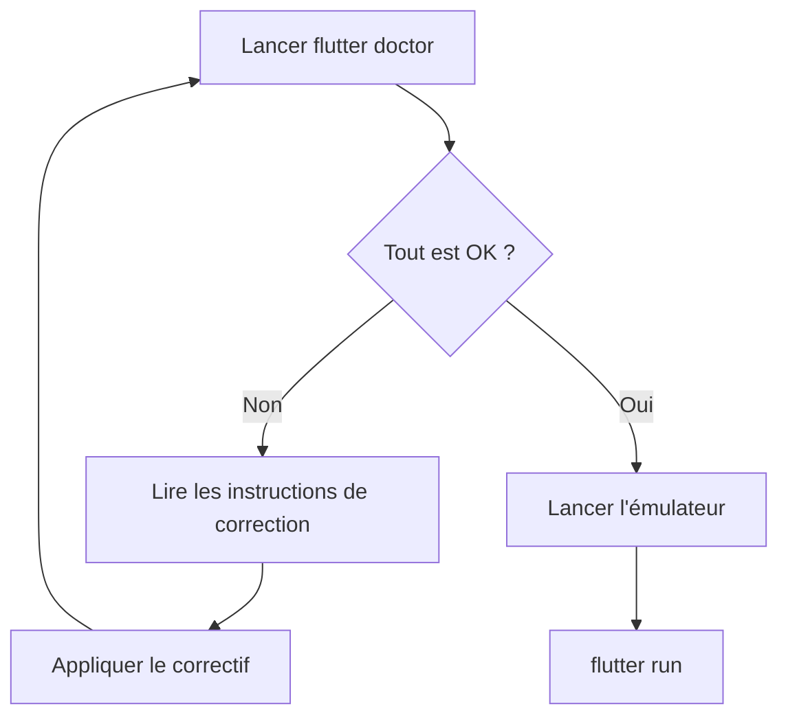

# 1-2-2 Utilisation de 'flutter doctor' et gestion des émulateurs

La maîtrise de l'environnement de développement repose sur la capacité à diagnostiquer les problèmes de configuration et à tester l'application sur des cibles variées.

## 1. Diagnostic avec `flutter doctor`

La commande `flutter doctor` est l'outil de diagnostic principal. Elle vérifie l'installation du SDK, la présence des outils de build (Android SDK, Xcode, Chrome, etc.) et l'état des IDE.

### Fonctionnement
*   **Analyse :** Le framework interroge le système pour localiser les dépendances nécessaires.
*   **Rapport :** Il affiche une liste de coches (✅) pour les éléments configurés et de croix (❌) pour les éléments manquants ou mal configurés.
*   **Résolution :** Le rapport indique souvent la commande exacte à exécuter pour corriger une erreur (ex: acceptation des licences Android).

### Exemple de flux de travail
```bash
# Lancer le diagnostic
flutter doctor

# Exemple de correction courante pour Android
flutter doctor --android-licenses
```

## 2. Gestion des émulateurs et simulateurs

Pour tester une application, vous devez disposer d'un environnement d'exécution.

*   **Émulateur Android (AVD) :** Créé via Android Studio (Device Manager). Il permet de simuler différentes versions d'Android et différentes tailles d'écran (tablettes, téléphones pliables).
*   **Simulateur iOS :** Disponible uniquement sur macOS via Xcode. Il simule les appareils Apple.
*   **Appareils physiques :** Connectés via USB ou Wi-Fi (mode débogage activé).

### Comparatif des environnements de test

| Type | Avantages | Inconvénients |
| :--- | :--- | :--- |
| **Émulateur** | Gratuit, multi-versions, facile à configurer | Consomme beaucoup de RAM, pas de capteurs réels |
| **Appareil physique** | Performance réelle, capteurs (GPS, Bluetooth) | Coûteux, gestion des câbles/batterie |

## 3. Bonnes pratiques professionnelles

*   **Automatisation :** Intégrez `flutter doctor` dans vos scripts de CI/CD pour vérifier que l'environnement de build est conforme avant de lancer les tests automatisés.
*   **Nettoyage :** Si une application ne se compile plus après une mise à jour de dépendances, utilisez `flutter clean` suivi de `flutter pub get` avant de chercher une erreur de configuration complexe.
*   **Diversité des tests :** Configurez au moins deux émulateurs : un avec une version d'OS récente et un avec une version minimale supportée par votre projet.

## 4. Points de vigilance et erreurs fréquentes

*   **Licences Android :** L'erreur la plus fréquente après une installation est l'absence d'acceptation des licences. `flutter doctor` le détecte systématiquement.
*   **Virtualisation (VT-x/AMD-V) :** Si les émulateurs Android sont extrêmement lents, vérifiez que la virtualisation est activée dans le BIOS/UEFI de votre machine.
*   **Espace disque :** Les images d'émulateurs (AVD) occupent plusieurs gigaoctets. Nettoyez régulièrement les images inutilisées dans le Device Manager d'Android Studio.
*   **Conflits de ports :** Si vous lancez plusieurs émulateurs, assurez-vous que votre machine dispose de suffisamment de ressources CPU, sous peine de voir le *Hot Reload* ralentir considérablement.



## Sources
*   [Flutter Documentation - Testing and debugging](https://docs.flutter.dev/testing)
*   [Flutter Documentation - Android setup](https://docs.flutter.dev/get-started/install/windows/android)