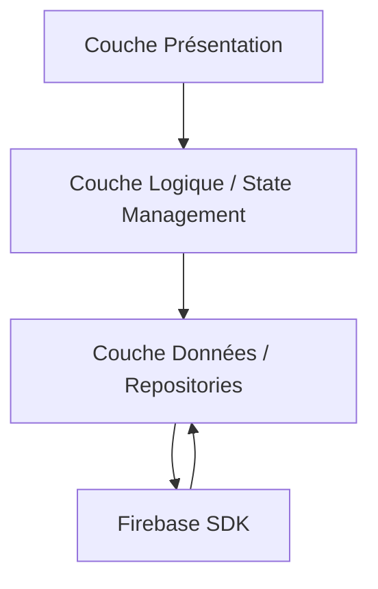

# 10-1-1 Architecture globale du projet final : Event Planner App

Pour le projet "Event Planner App", une architecture robuste est nécessaire pour séparer la logique métier, la gestion des données et l'interface utilisateur. Nous adopterons une structure basée sur le pattern **Layered Architecture** (Architecture en couches).

## 1. Concepts fondamentaux
*   **Couche Présentation (UI) :** Widgets Flutter responsables de l'affichage et de l'interaction utilisateur.
*   **Couche Domaine (Logique) :** Modèles de données et classes de gestion (ex: `EventService`) qui traitent les règles métier.
*   **Couche Données (Data) :** Interaction avec les services externes (Firebase Auth, Firestore).

## 2. Structure de dossiers recommandée
Une organisation claire facilite la maintenance et la montée en charge du projet.

```text
lib/
├── core/           # Constantes, thèmes, utilitaires
├── data/           # Modèles de données, repositories
├── logic/          # Gestion d'état (ex: Provider, Bloc)
├── presentation/   # Écrans (screens) et widgets réutilisables
└── main.dart       # Point d'entrée
```

## 3. Fonctionnement détaillé
L'application suit un flux unidirectionnel :
1.  **UI :** L'utilisateur interagit avec un widget (ex: bouton "Créer événement").
2.  **Logic :** Le gestionnaire d'état intercepte l'action et appelle un service.
3.  **Data :** Le service communique avec Firebase (Firestore/Auth).
4.  **UI :** L'état est mis à jour, provoquant un rafraîchissement automatique de l'interface.

## 4. Diagramme d'architecture



## 5. Bonnes pratiques professionnelles
*   **Injection de dépendances :** Utilisez des packages comme `get_it` pour injecter vos services et éviter de passer des instances manuellement dans les constructeurs.
*   **Modèles immuables :** Utilisez des classes `data` avec `freezed` ou `equatable` pour garantir la cohérence des données.
*   **Gestion des erreurs :** Centralisez la gestion des exceptions Firebase dans la couche `data` pour renvoyer des messages d'erreur exploitables par l'UI.

## 6. Points de vigilance
*   **Couplage :** Évitez d'importer `firebase_auth` directement dans vos widgets. Passez par une classe de service intermédiaire pour faciliter les tests unitaires.
*   **Scalabilité :** Ne surchargez pas le fichier `main.dart`. Découpez vos configurations (Firebase, routes, thèmes) dans des fichiers dédiés.
*   **Sécurité :** Vérifiez que vos règles Firestore sont configurées pour restreindre l'accès aux données aux seuls utilisateurs authentifiés avant de finaliser le déploiement.

## 7. Comparatif des approches de gestion d'état

| Approche | Complexité | Cas d'usage |
| :--- | :--- | :--- |
| **Provider** | Faible | Projets simples, apprentissage |
| **Riverpod** | Moyenne | Projets robustes, testabilité élevée |
| **Bloc** | Élevée | Projets complexes, logique métier lourde |

## 8. Recommandations pour le projet
Pour l'Event Planner App, **Riverpod** est recommandé pour sa flexibilité et sa capacité à gérer facilement l'état de l'authentification Firebase combiné aux données Firestore. Assurez-vous de créer un `Repository` pour chaque entité (ex: `EventRepository`, `UserRepository`) afin d'abstraire les appels API.

## Sources
*   [Flutter Architecture Samples](https://docs.flutter.dev/ui/architecture)
*   [Riverpod Documentation](https://riverpod.dev/)