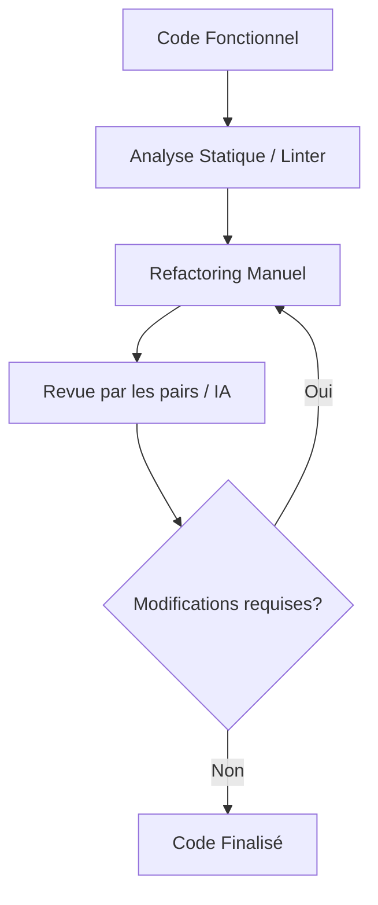

# 10-1-2 Nettoyage du code et revue par les pairs (ou IA)

La phase de finalisation d'un projet consiste à transformer un code fonctionnel en un code maintenable, lisible et performant. Cette étape repose sur le nettoyage technique et la validation par un regard extérieur.

## 1. Concepts fondamentaux
*   **Refactoring :** Processus de modification de la structure interne du code sans changer son comportement externe.
*   **Code Review :** Examen systématique du code source par un tiers pour identifier des erreurs, des vulnérabilités ou des opportunités d'amélioration.
*   **Linter :** Outil d'analyse statique qui vérifie le respect des conventions de nommage et de style (ex: `flutter_lints`).

## 2. Processus de nettoyage
Le nettoyage doit suivre une approche méthodique :

1.  **Suppression du code mort :** Éliminer les imports inutilisés, les variables non déclarées et les fonctions commentées.
2.  **Standardisation :** Appliquer le formatage automatique (`dart format .`).
3.  **Simplification :** Extraire les widgets complexes en petits composants réutilisables.
4.  **Nommage :** Vérifier que les noms de variables et de fonctions reflètent clairement leur rôle.

## 3. Revue par les pairs vs IA
| Méthode | Avantages | Limites |
| :--- | :--- | :--- |
| **Revue par les pairs** | Partage de connaissances, contexte métier | Chronophage, dépend de la disponibilité |
| **Revue par IA** | Immédiate, disponible 24/7, exhaustive | Manque de contexte métier, hallucinations |

## 4. Bonnes pratiques de revue
*   **Checklist de revue :**
    *   Le code respecte-t-il les principes SOLID ?
    *   La gestion des erreurs est-elle robuste ?
    *   Les accès aux données sont-ils sécurisés ?
    *   La documentation (commentaires) est-elle utile et non redondante ?
*   **Utilisation de l'IA :** Utilisez l'IA pour suggérer des optimisations de performance ou pour expliquer des parties complexes du code, mais validez toujours les suggestions manuellement.

## 5. Erreurs fréquentes à éviter
*   **Revue superficielle :** Se concentrer uniquement sur le style (espaces, virgules) au lieu de la logique métier.
*   **Refactoring massif sans tests :** Modifier une architecture complexe sans avoir de tests unitaires pour valider la non-régression.
*   **Ignorer les warnings du Linter :** Les avertissements du compilateur indiquent souvent des problèmes de performance ou de sécurité potentiels.

## 6. Flux de travail de finalisation

## 7. Points de vigilance
*   **Sécurité :** Vérifiez qu'aucune clé API ou donnée sensible n'est codée en dur dans le dépôt. Utilisez des fichiers `.env`.
*   **Performance :** Analysez les rebuilds inutiles dans vos widgets avec l'outil *Flutter DevTools*.
*   **Accessibilité :** Assurez-vous que les modifications de nettoyage n'ont pas altéré la sémantique des composants.

## 8. Recommandations actuelles
Intégrez l'analyse statique dans votre pipeline CI/CD. Configurez le fichier `analysis_options.yaml` avec des règles strictes pour garantir une qualité de code constante dès le développement. Pour la revue par IA, fournissez un contexte clair (ex: "Voici mon service de gestion d'événements, peux-tu vérifier les fuites de mémoire potentielles ?").

## Sources
*   [Dart Style Guide](https://dart.dev/guides/language/effective-dart/style)
*   [Flutter DevTools Documentation](https://docs.flutter.dev/tools/devtools/overview)