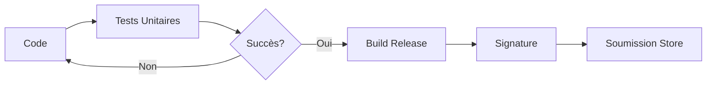

# 10-1-3 Introduction aux tests unitaires et publication

La phase finale d'un projet consiste à garantir sa stabilité via les tests et à préparer sa distribution sur les stores.

## 1. Concepts fondamentaux
*   **Test unitaire :** Vérification du comportement d'une fonction, méthode ou classe isolée.
*   **Mocking :** Simulation de dépendances externes (API, base de données) pour tester une logique sans effets de bord.
*   **Publication :** Processus de préparation, signature et déploiement de l'application sur le Google Play Store ou l'Apple App Store.

## 2. Tests unitaires avec `test`
Flutter utilise le package `test` pour valider la logique métier.

### Exemple de test
```dart
void main() {
  test('Le calcul du prix total doit inclure la TVA', () {
    final service = EventService();
    final total = service.calculatePrice(100, 0.2);
    expect(total, 120.0);
  });
}
```

## 3. Stratégie de publication
La publication nécessite plusieurs étapes techniques :
1.  **Configuration :** Mise à jour du `pubspec.yaml` (version, nom, icône).
2.  **Sécurisation :** Utilisation de fichiers `.env` pour les clés API.
3.  **Build :** Génération des bundles (`flutter build appbundle` pour Android, `flutter build ipa` pour iOS).
4.  **Signature :** Utilisation de certificats de signature (Keystore pour Android, Provisioning Profiles pour iOS).

## 4. Comparatif : Types de tests

| Type | Portée | Rapidité |
| :--- | :--- | :--- |
| **Unitaire** | Fonction / Classe | Très rapide |
| **Widget** | Widget unique | Rapide |
| **Intégration** | Application complète | Lent |

## 5. Bonnes pratiques professionnelles
*   **Taux de couverture :** Visez une couverture de code significative sur la logique métier (services, modèles).
*   **Automatisation :** Utilisez des outils de CI/CD (GitHub Actions, Codemagic) pour lancer les tests automatiquement à chaque `push`.
*   **Gestion des versions :** Respectez le versioning sémantique (Major.Minor.Patch).

## 6. Erreurs fréquentes à éviter
*   **Tester l'implémentation :** Testez le résultat attendu, pas la manière dont la fonction est écrite.
*   **Oublier les cas limites :** Ne testez pas seulement les cas nominaux, testez aussi les entrées nulles ou les erreurs réseau.
*   **Publication en mode debug :** N'oubliez jamais de compiler en mode `--release`.

## 7. Flux de publication



## 8. Points de vigilance
*   **Secrets :** Ne jamais inclure de fichiers contenant des clés privées dans le contrôle de version (Git).
*   **Icônes et Assets :** Vérifiez la conformité des icônes avec les guidelines des stores.
*   **Permissions :** Vérifiez que les permissions demandées dans `AndroidManifest.xml` et `Info.plist` sont strictement nécessaires au fonctionnement de l'application.

## 9. Recommandations actuelles
Pour la publication, privilégiez des outils comme **Codemagic** qui automatisent la signature et la soumission sur les stores. Pour les tests, utilisez le package `mocktail` pour simplifier la création de mocks de vos services Firebase.

## Sources
*   [Flutter Documentation - Testing](https://docs.flutter.dev/testing)
*   [Flutter Documentation - Publishing](https://docs.flutter.dev/deployment)
*   [Mocktail Package](https://pub.dev/packages/mocktail)