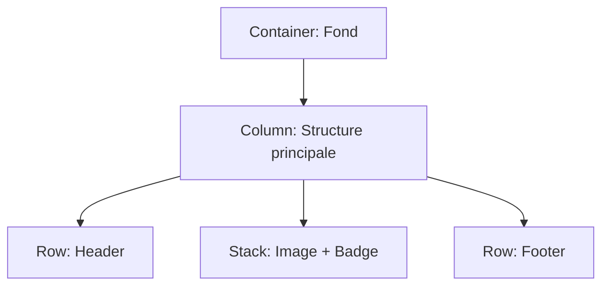

# 2-1-1 Widgets de structure : Row, Column, Stack, Container

La composition d'interfaces dans Flutter repose sur l'imbrication de widgets. Les widgets de structure permettent d'organiser, d'aligner et de styliser les éléments visuels.

## 1. Organisation linéaire : Row et Column

Ces widgets permettent de disposer des éléments de manière unidimensionnelle.

*   **Row (Ligne) :** Aligne les enfants horizontalement.
*   **Column (Colonne) :** Aligne les enfants verticalement.

### Propriétés clés
*   `mainAxisAlignment` : Définit l'alignement sur l'axe principal (horizontal pour Row, vertical pour Column).
*   `crossAxisAlignment` : Définit l'alignement sur l'axe secondaire (vertical pour Row, horizontal pour Column).

```dart
// Exemple : Une ligne avec deux éléments espacés
Row(
  mainAxisAlignment: MainAxisAlignment.spaceBetween,
  children: [
    Icon(Icons.person),
    Text("Profil utilisateur"),
  ],
)
```

## 2. Superposition : Stack

Le widget `Stack` permet de placer des widgets les uns au-dessus des autres. Il est idéal pour superposer du texte sur une image ou afficher un badge sur une icône.

*   **Positionnement :** Utilisez le widget `Positioned` comme enfant direct d'une `Stack` pour définir précisément les coordonnées (top, bottom, left, right).

## 3. Le couteau suisse : Container

Le `Container` est un widget polyvalent qui combine plusieurs fonctionnalités : décoration, padding, marges, taille et alignement.

*   **Usage :** À utiliser pour ajouter un fond coloré, des bordures arrondies ou des espacements autour d'un widget.
*   **Attention :** Un `Container` sans enfant tente de prendre toute la taille disponible, alors qu'un `Container` avec un enfant s'adapte à la taille de celui-ci.

## 4. Comparatif des widgets de structure

| Widget | Rôle principal | Axe de disposition |
| :--- | :--- | :--- |
| **Row** | Alignement horizontal | Horizontal |
| **Column** | Alignement vertical | Vertical |
| **Stack** | Superposition | Z-index (profondeur) |
| **Container** | Décoration et mise en forme | N/A (boîte unique) |

## 5. Bonnes pratiques et points de vigilance

### Erreurs fréquentes
*   **Débordement (Overflow) :** Placer trop d'éléments dans une `Row` ou `Column` sans utiliser `Expanded` ou `Flexible` provoque une erreur de type "RenderFlex overflowed".
*   **Imbrication excessive :** Créer des arbres de widgets trop profonds rend le code difficile à maintenir. Extrayez les sous-parties de votre UI dans des méthodes ou des classes de widgets dédiées.
*   **Utilisation abusive de Container :** Si vous n'avez besoin que d'un padding, utilisez le widget `Padding` plutôt qu'un `Container`. Il est plus léger.

### Points de vigilance
*   **Flexibilité :** Utilisez `Expanded` pour forcer un enfant à occuper tout l'espace restant dans une `Row` ou `Column`.
*   **Performance :** Le `Stack` est plus coûteux en ressources que `Row` ou `Column`. Utilisez-le uniquement lorsque la superposition est nécessaire.

### Exemple de structure complexe


## 6. Recommandations professionnelles
*   **Design System :** Pour des interfaces cohérentes, créez vos propres widgets de structure réutilisables (ex: `AppButton`, `ProfileCard`) plutôt que de répéter des `Container` avec les mêmes propriétés de décoration.
*   **Lisibilité :** Utilisez des commentaires pour délimiter les blocs de widgets complexes dans vos fichiers Dart.

## Sources
*   [Flutter Documentation - Layout widgets](https://docs.flutter.dev/ui/layout)
*   [Flutter Documentation - Box model](https://docs.flutter.dev/ui/layout/box)