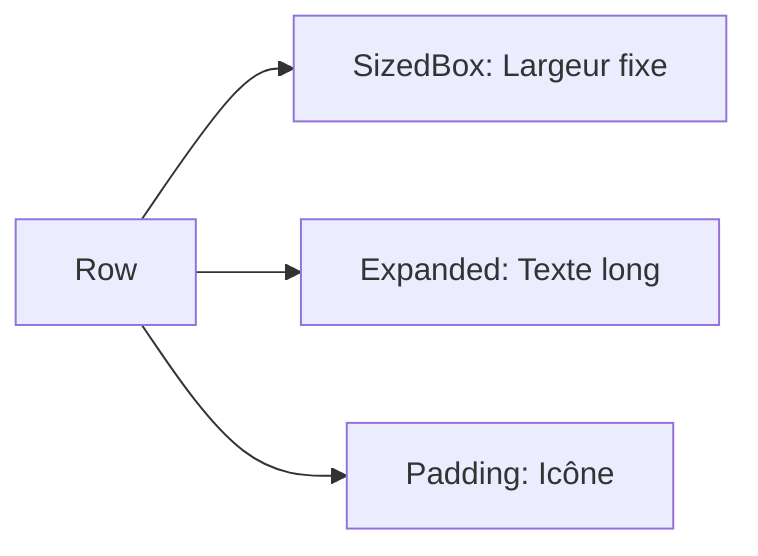

# 2-1-2 Gestion de l'espace : Padding, Margin, SizedBox, Expanded

La maîtrise de l'espacement est déterminante pour la qualité visuelle d'une interface. Flutter propose des outils spécifiques pour contrôler les dimensions et les zones vides.

## 1. Padding et Margin
Dans Flutter, le concept de "margin" n'existe pas en tant que propriété native de tous les widgets.

*   **Padding :** Ajoute de l'espace *à l'intérieur* des limites d'un widget. Le widget `Padding` est la méthode standard pour appliquer cet espacement.
*   **Margin :** Pour simuler une marge (espace *extérieur*), on utilise généralement un widget `Padding` parent ou les propriétés `margin` du widget `Container`.

## 2. SizedBox : Contrôle dimensionnel
Le `SizedBox` est un widget simple permettant de forcer des dimensions précises ou d'ajouter un espace vide entre deux éléments.

*   **Espaceur :** Utilisé dans une `Row` ou `Column` pour créer un écart fixe.
*   **Contrainte :** Utilisé pour forcer un enfant à avoir une largeur ou une hauteur spécifique.

```dart
// Exemple : Espace fixe entre deux boutons
Column(
  children: [
    ElevatedButton(onPressed: () {}, child: Text("Valider")),
    SizedBox(height: 20), // Espace de 20 pixels
    ElevatedButton(onPressed: () {}, child: Text("Annuler")),
  ],
)
```

## 3. Expanded : Gestion dynamique
Le widget `Expanded` est indispensable pour occuper l'espace disponible au sein d'une `Row` ou d'une `Column`.

*   **Fonctionnement :** Il force son enfant à s'étendre pour remplir l'espace restant sur l'axe principal.
*   **Flex :** La propriété `flex` permet de définir des ratios (ex: un élément occupant 2/3 de l'espace et un autre 1/3).

## 4. Comparatif des outils d'espacement

| Widget | Usage principal | Comportement |
| :--- | :--- | :--- |
| **Padding** | Espacement interne | Ajoute du vide autour du contenu |
| **SizedBox** | Espace fixe ou taille imposée | Taille rigide |
| **Expanded** | Remplissage dynamique | Occupe tout l'espace disponible |

## 5. Bonnes pratiques et points de vigilance

### Erreurs fréquentes
*   **SizedBox vs Padding :** Utiliser un `Container` avec un `padding` juste pour créer un espace vide est trop lourd. Préférez `SizedBox` pour des espaces simples ou `Padding` pour envelopper un widget existant.
*   **Expanded en dehors d'un Flex :** Utiliser `Expanded` en dehors d'une `Row`, `Column` ou `Flex` provoquera une erreur à l'exécution.
*   **Valeurs "en dur" :** Évitez de multiplier les valeurs numériques fixes (ex: `SizedBox(height: 20)`). Utilisez des constantes ou des variables de thème pour garantir la cohérence visuelle de l'application.

### Points de vigilance
*   **Flexibilité :** Si vous avez plusieurs `Expanded` dans une `Row`, ils se partageront l'espace disponible en fonction de leur valeur `flex`.
*   **Débordement :** Si le contenu d'un `Expanded` est trop grand, il peut provoquer un débordement. Combinez-le avec des widgets de défilement (`SingleChildScrollView`) si nécessaire.

### Exemple de mise en page professionnelle


## 6. Recommandations actuelles
*   **Utilisation de `Spacer` :** Pour créer un espace flexible entre deux éléments dans une `Row` ou `Column`, le widget `Spacer` est une alternative plus lisible à `Expanded(child: SizedBox())`.
*   **Constantes :** Définissez des espacements standards dans un fichier `constants.dart` (ex: `static const double spacing = 16.0;`) pour uniformiser le design de l'application.

## Sources
*   [Flutter Documentation - Padding class](https://api.flutter.dev/flutter/widgets/Padding-class.html)
*   [Flutter Documentation - Expanded class](https://api.flutter.dev/flutter/widgets/Expanded-class.html)
*   [Flutter Documentation - SizedBox class](https://api.flutter.dev/flutter/widgets/SizedBox-class.html)