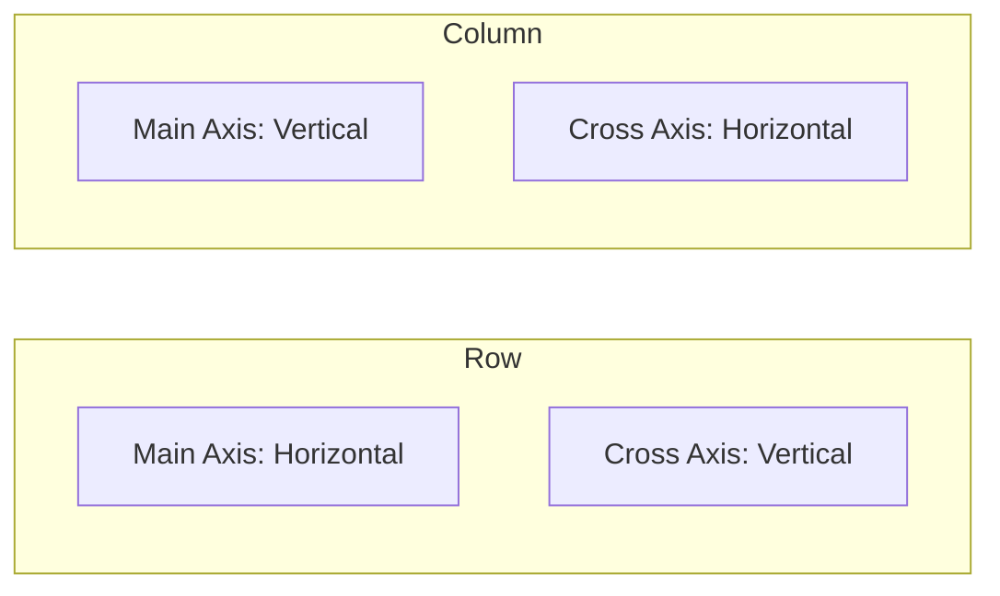

# 2-1-3 Alignements : MainAxisAlignment et CrossAxisAlignment

La disposition des éléments au sein d'une `Row` ou d'une `Column` est contrôlée par deux axes. Comprendre leur interaction est la clé pour créer des interfaces fluides et adaptatives.

## 1. Les deux axes de disposition

Chaque widget de type `Flex` (comme `Row` ou `Column`) possède deux axes :

*   **Main Axis (Axe principal) :** L'axe sur lequel les enfants sont alignés par défaut.
    *   `Row` : Horizontal.
    *   `Column` : Vertical.
*   **Cross Axis (Axe secondaire) :** L'axe perpendiculaire à l'axe principal.
    *   `Row` : Vertical.
    *   `Column` : Horizontal.

## 2. MainAxisAlignment : Contrôle de l'axe principal

Cette propriété définit comment l'espace disponible est distribué entre et autour des enfants sur l'axe principal.

*   **`start` :** Les enfants sont regroupés au début de l'axe.
*   **`end` :** Les enfants sont regroupés à la fin de l'axe.
*   **`center` :** Les enfants sont centrés.
*   **`spaceBetween` :** Espace égal entre les enfants, aucun espace aux extrémités.
*   **`spaceAround` :** Espace égal entre les enfants, avec la moitié de cet espace aux extrémités.
*   **`spaceEvenly` :** Espace égal entre tous les éléments, y compris aux extrémités.

## 3. CrossAxisAlignment : Contrôle de l'axe secondaire

Cette propriété définit comment les enfants sont alignés perpendiculairement à l'axe principal.

*   **`start` :** Alignement sur le bord supérieur (Row) ou gauche (Column).
*   **`end` :** Alignement sur le bord inférieur (Row) ou droit (Column).
*   **`center` :** Alignement au centre.
*   **`stretch` :** Force les enfants à occuper toute la taille disponible sur l'axe secondaire.

## 4. Comparatif visuel

| Propriété | Effet sur l'axe |
| :--- | :--- |
| `MainAxisAlignment` | Distribution de l'espace vide |
| `CrossAxisAlignment` | Positionnement perpendiculaire |

## 5. Bonnes pratiques et points de vigilance

### Erreurs fréquentes
*   **Taille du parent :** Si une `Row` ou `Column` a la même taille que ses enfants, `MainAxisAlignment` n'aura aucun effet visuel car il n'y a pas d'espace libre à distribuer.
*   **Confusion des axes :** Oublier que dans une `Row`, `CrossAxisAlignment` gère la hauteur, tandis que dans une `Column`, il gère la largeur.

### Points de vigilance
*   **`stretch` et performance :** L'utilisation de `CrossAxisAlignment.stretch` est très utile pour créer des formulaires où les champs de texte doivent occuper toute la largeur, mais assurez-vous que les enfants supportent cette contrainte de taille.
*   **Débogage :** Si un alignement ne semble pas fonctionner, entourez temporairement votre `Row` ou `Column` d'un `Container` avec une couleur de fond pour visualiser l'espace réellement occupé par le widget.

### Exemple concret : Barre d'outils
Dans une application de gestion de tâches, pour aligner une icône à gauche et un bouton à droite dans une `Row` :

```dart
Row(
  mainAxisAlignment: MainAxisAlignment.spaceBetween,
  children: [
    Icon(Icons.menu),
    ElevatedButton(onPressed: () {}, child: Text("Ajouter")),
  ],
)
```

## 6. Diagramme de flux des axes



## Sources
*   [Flutter Documentation - MainAxisAlignment enum](https://api.flutter.dev/flutter/rendering/MainAxisAlignment-values.html)
*   [Flutter Documentation - CrossAxisAlignment enum](https://api.flutter.dev/flutter/rendering/CrossAxisAlignment-values.html)