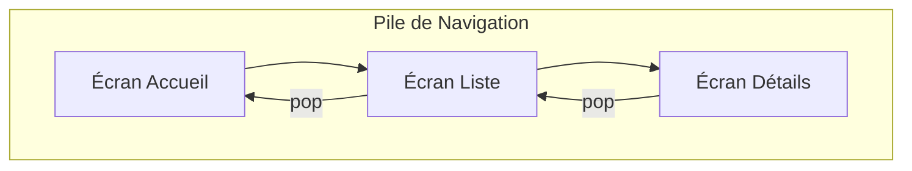

# 3-1-1 Navigation impérative (Navigator 1.0) et routes nommées

La navigation dans Flutter repose sur le concept de pile (Stack). Le `Navigator` gère cette pile en ajoutant ou en supprimant des écrans.

## 1. Concepts fondamentaux : La pile de navigation

Le `Navigator` fonctionne comme une pile LIFO (*Last In, First Out*).
*   **Push :** Ajoute un nouvel écran au sommet de la pile.
*   **Pop :** Retire l'écran actuel pour revenir au précédent.

## 2. Navigation impérative (Navigator.push)

La méthode la plus directe consiste à utiliser `MaterialPageRoute`. Elle permet de définir dynamiquement l'écran de destination.

```dart
// Navigation vers un nouvel écran
Navigator.of(context).push(
  MaterialPageRoute(builder: (context) => const DetailsScreen()),
);

// Retour à l'écran précédent
Navigator.of(context).pop();
```

## 3. Routes nommées

Pour éviter de répéter les constructeurs de pages, on utilise une table de routage définie dans le `MaterialApp`.

### Configuration
```dart
MaterialApp(
  initialRoute: '/',
  routes: {
    '/': (context) => const HomeScreen(),
    '/details': (context) => const DetailsScreen(),
  },
);
```

### Utilisation
```dart
// Navigation via le nom de la route
Navigator.pushNamed(context, '/details');
```

## 4. Comparatif des approches

| Approche | Avantages | Inconvénients |
| :--- | :--- | :--- |
| **Push direct** | Simple, typé, passage de paramètres facile | Couplage fort entre les écrans |
| **Routes nommées** | Centralisation, lisibilité | Passage de paramètres complexe |

## 5. Bonnes pratiques et points de vigilance

### Gestion des paramètres
Avec les routes nommées, le passage de données complexes (objets métiers) est fastidieux. Utilisez `ModalRoute.of(context)!.settings.arguments` pour récupérer les données transmises lors du `pushNamed`.

### Erreurs fréquentes
*   **Context invalide :** Appeler `Navigator` avec un `context` qui n'est pas un descendant du `Navigator` (souvent lors de l'utilisation d'un `Builder` ou d'un `async` trop long).
*   **Oubli du `pop` :** Ne pas gérer le retour arrière, ce qui bloque l'utilisateur sur une page.

### Points de vigilance
*   **Profondeur de pile :** Une pile trop profonde consomme de la mémoire. Utilisez `pushReplacementNamed` pour remplacer l'écran actuel (ex: écran de login vers écran d'accueil) afin d'éviter que l'utilisateur ne puisse revenir en arrière sur l'écran de connexion.
*   **Découplage :** Pour des applications de grande taille, la navigation impérative devient difficile à maintenir. Bien que le `Navigator 1.0` soit suffisant pour des besoins simples, envisagez des solutions basées sur des packages de routage (comme `go_router`) pour gérer les liens profonds (*deep linking*) et les états complexes.

## 6. Diagramme de la pile (Stack)



## Sources
*   [Flutter Documentation - Navigation and routing](https://docs.flutter.dev/ui/navigation)
*   [Flutter API - Navigator class](https://api.flutter.dev/flutter/widgets/Navigator-class.html)