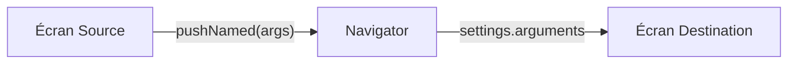

# 3-1-2 Passage d'arguments lors de la transition

Le passage de données entre écrans est une nécessité pour construire des interfaces dynamiques, comme l'affichage des détails d'un produit sélectionné dans une liste.

## 1. Passage d'arguments via le constructeur (Navigation impérative)

C'est la méthode la plus directe et la plus sûre en termes de typage. Vous passez les données directement au constructeur de la page de destination.

```dart
// Écran source
Navigator.of(context).push(
  MaterialPageRoute(
    builder: (context) => DetailsScreen(productId: "123"),
  ),
);

// Écran destination
class DetailsScreen extends StatelessWidget {
  final String productId;
  const DetailsScreen({super.key, required this.productId});
  // ...
}
```

## 2. Passage d'arguments via les routes nommées

Lorsque vous utilisez `pushNamed`, vous devez transmettre les données via le paramètre `arguments`.

### Envoi des données
```dart
Navigator.pushNamed(
  context, 
  '/details', 
  arguments: {'id': '123', 'name': 'Produit A'},
);
```

### Récupération des données
Dans l'écran de destination, vous accédez aux arguments via `ModalRoute`.

```dart
final args = ModalRoute.of(context)!.settings.arguments as Map<String, String>;
final productId = args['id'];
```

## 3. Comparatif des méthodes

| Méthode | Typage | Complexité | Usage recommandé |
| :--- | :--- | :--- | :--- |
| **Constructeur** | Fort (Compile-time) | Faible | Navigation simple et directe |
| **Routes nommées** | Faible (Runtime) | Moyenne | Navigation centralisée, deep linking |

## 4. Bonnes pratiques professionnelles

*   **Utilisation de classes de données :** Au lieu de passer des `Map` ou des `dynamic`, créez des classes dédiées pour vos arguments. Cela permet de bénéficier de l'autocomplétion et de la sécurité du typage.
*   **Validation :** Vérifiez toujours que les arguments reçus ne sont pas nuls avant de les utiliser, surtout avec `ModalRoute`.
*   **Séparation des responsabilités :** L'écran de destination ne doit pas savoir comment les données sont récupérées. Il doit simplement recevoir les paramètres nécessaires via son constructeur.

## 5. Erreurs fréquentes et points de vigilance

*   **Casting erroné :** Utiliser `as` sur un type incorrect lors de la récupération des arguments provoque un crash à l'exécution.
*   **Arguments manquants :** Si une route nommée est appelée sans arguments alors que l'écran en attend, l'application échouera.
*   **Données complexes :** Évitez de passer des objets métier très complexes ou des instances de services via la navigation. Préférez passer un identifiant (ID) et récupérer l'objet complet depuis un gestionnaire d'état ou une base de données locale.

## 6. Flux de transmission



## 7. Recommandation actuelle
Pour des applications professionnelles, la gestion manuelle des arguments avec `ModalRoute` devient rapidement complexe. L'utilisation de bibliothèques de routage modernes comme **go_router** permet de définir des routes avec des paramètres typés directement dans l'URL (ex: `/details/:id`), ce qui simplifie grandement la maintenance et améliore la gestion du *deep linking*.

## Sources
*   [Flutter Documentation - Passing arguments to a named route](https://docs.flutter.dev/cookbook/navigation/navigate-with-arguments)
*   [Flutter API - ModalRoute class](https://api.flutter.dev/flutter/widgets/ModalRoute-class.html)