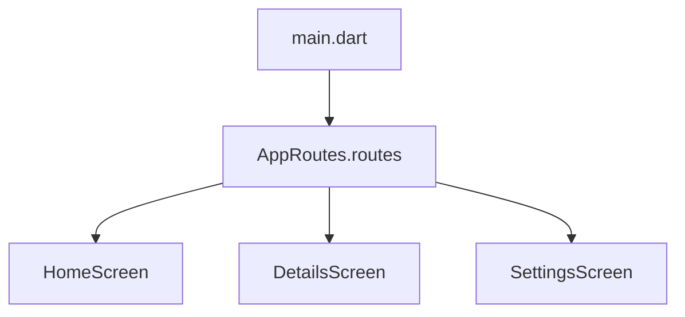

# 3-1-3 Organisation du fichier de routes principal

La centralisation de la navigation est une étape déterminante pour la maintenabilité d'une application Flutter. Un fichier de routes bien structuré évite la dispersion de la logique de navigation dans l'ensemble du code source.

## 1. Centralisation des routes
Au lieu de définir les routes directement dans le `MaterialApp`, il est recommandé de les isoler dans une classe dédiée ou un fichier spécifique (ex: `app_router.dart`).

### Structure recommandée
```dart
class AppRoutes {
  static const String home = '/';
  static const String details = '/details';
  static const String settings = '/settings';

  static Map<String, WidgetBuilder> get routes => {
    home: (context) => const HomeScreen(),
    details: (context) => const DetailsScreen(),
    settings: (context) => const SettingsScreen(),
  };
}
```

## 2. Utilisation dans le MaterialApp
Cette approche permet de garder le fichier `main.dart` propre et lisible.

```dart
MaterialApp(
  initialRoute: AppRoutes.home,
  routes: AppRoutes.routes,
);
```

## 3. Avantages de la centralisation
*   **Maintenance facilitée :** Modifier le nom d'une route ou changer un écran se fait en un seul endroit.
*   **Lisibilité :** Le `main.dart` ne contient plus la configuration technique des routes.
*   **Réutilisation :** Les constantes de routes (`AppRoutes.home`) peuvent être utilisées partout dans l'application pour éviter les fautes de frappe lors des appels `pushNamed`.

## 4. Bonnes pratiques professionnelles
*   **Utilisation de constantes :** Ne jamais utiliser de chaînes de caractères "en dur" (hardcoded) pour les noms de routes. Utilisez toujours les constantes définies dans votre classe `AppRoutes`.
*   **Découpage par module :** Pour les applications de grande envergure, créez des fichiers de routes par fonctionnalité (ex: `auth_routes.dart`, `profile_routes.dart`) et fusionnez-les dans un fichier principal.
*   **Gestion des routes inconnues :** Utilisez la propriété `onGenerateRoute` dans le `MaterialApp` pour gérer les cas où une route n'est pas trouvée, permettant d'afficher une page d'erreur personnalisée.

## 5. Erreurs fréquentes et points de vigilance
*   **Importations circulaires :** Veillez à ce que votre fichier de routes n'importe pas des widgets qui, eux-mêmes, importent le fichier de routes.
*   **Oubli de mise à jour :** Ajouter un écran sans l'enregistrer dans la table de routage est une source fréquente de bugs.
*   **Complexité excessive :** Si votre fichier de routes dépasse quelques centaines de lignes, il est temps de le diviser par domaine fonctionnel.

## 6. Organisation logique



## 7. Recommandations actuelles
Bien que la méthode `routes` soit native et simple, elle montre ses limites pour des besoins avancés (protection de routes, redirection conditionnelle, paramètres complexes). Pour des projets professionnels, l'adoption d'un package comme **go_router** est devenue la norme. Il permet une configuration déclarative des routes, une meilleure gestion des états de navigation et une compatibilité native avec le Web (URL propres).

## Sources
*   [Flutter Documentation - Navigation and routing](https://docs.flutter.dev/ui/navigation)
*   [Go Router Package - Documentation](https://pub.dev/packages/go_router)