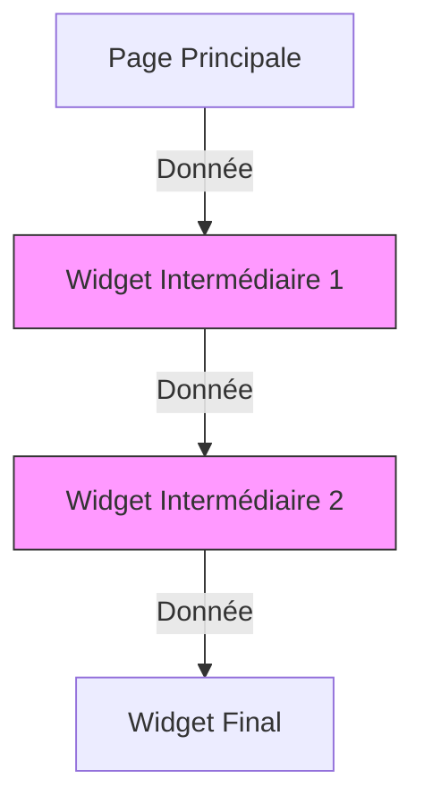

# 4-1-1 Limites de setState pour les applications complexes

Le widget `StatefulWidget` et sa méthode `setState()` constituent le mécanisme de base pour mettre à jour l'interface utilisateur dans Flutter. Cependant, leur utilisation intensive dans des applications de grande envergure pose des problèmes structurels.

## 1. Fonctionnement de setState
`setState()` informe le framework que l'état interne d'un widget a changé, déclenchant ainsi une reconstruction de la méthode `build()` de ce widget et de ses enfants.

```dart
// Exemple simple : Compteur
setState(() {
  _counter++;
});
```

## 2. Limites dans les applications complexes

### Couplage fort (Spaghetti Code)
Lorsque la logique métier est mélangée à la logique d'affichage dans le widget, le code devient difficile à tester et à maintenir.

### "Prop Drilling" (Passage de paramètres en cascade)
Pour partager une donnée entre un widget parent et un petit-enfant situé plusieurs niveaux plus bas, vous devez passer cette donnée à travers chaque constructeur intermédiaire, même si ces widgets intermédiaires n'utilisent pas la donnée.

### Reconstructions inutiles
`setState()` reconstruit tout le sous-arbre du widget. Dans une application complexe, cela peut entraîner des problèmes de performance si des widgets lourds sont reconstruits inutilement.

## 3. Comparatif : setState vs Gestion d'état externe

| Caractéristique | setState | Gestion d'état (Provider/Bloc) |
| :--- | :--- | :--- |
| **Portée** | Locale au widget | Globale ou partagée |
| **Logique métier** | Mélangée à l'UI | Séparée de l'UI |
| **Maintenance** | Difficile à grande échelle | Facilitée par la séparation |
| **Testabilité** | Complexe (nécessite l'UI) | Simple (logique isolée) |

## 4. Cas d'usage : Quand éviter setState ?
*   **Données partagées :** Lorsque plusieurs écrans ont besoin d'accéder à la même information (ex: profil utilisateur, panier d'achat).
*   **Logique métier complexe :** Lorsque le traitement des données nécessite des appels API, des calculs ou des interactions avec des bases de données locales.
*   **Applications multi-écrans :** Lorsque l'état doit persister lors de la navigation entre différentes routes.

## 5. Erreurs fréquentes et points de vigilance

*   **Appel de setState après suppression :** Appeler `setState()` sur un widget qui a été retiré de l'arbre (ex: après une opération asynchrone) provoque une erreur. Vérifiez toujours `if (mounted)` avant.
*   **Logique métier dans build() :** Effectuer des calculs lourds ou des appels réseau directement dans `build()` ou `setState()` ralentit l'interface.
*   **Oubli de nettoyage :** Ne pas annuler les abonnements (streams, timers) dans la méthode `dispose()` crée des fuites de mémoire.

## 6. Illustration du problème de "Prop Drilling"


*Les widgets en rose sont forcés de recevoir la donnée uniquement pour la transmettre au suivant.*

## 7. Recommandations professionnelles
*   **Utilisez `setState` uniquement pour l'état éphémère :** C'est-à-dire l'état qui ne concerne qu'un seul widget (ex: état d'un champ de texte, animation locale, ouverture d'un menu déroulant).
*   **Externalisez la logique métier :** Dès qu'une donnée doit être partagée ou modifiée par plusieurs composants, déplacez-la vers une classe de gestion d'état (comme `ChangeNotifier` avec `Provider`).
*   **Priorisez la séparation des préoccupations :** Votre code doit être structuré de manière à ce que la logique métier puisse être testée sans instancier de widgets.

## Sources
*   [Flutter Documentation - Introduction to state management](https://docs.flutter.dev/data-and-backend/state-mgmt/intro)
*   [Flutter Documentation - Ephemeral vs App State](https://docs.flutter.dev/data-and-backend/state-mgmt/ephemeral-vs-app)