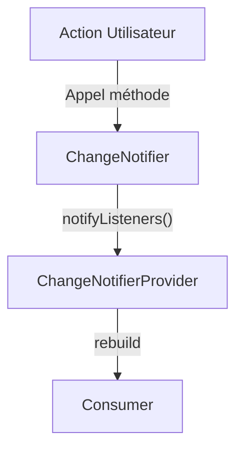

# 4-1-2 Introduction à Provider : ChangeNotifier, ChangeNotifierProvider, Consumer

Le package `provider` est une solution recommandée par l'équipe Flutter pour la gestion d'état. Il repose sur le mécanisme d'héritage des widgets (`InheritedWidget`) tout en simplifiant considérablement son utilisation.

## 1. Les trois piliers de Provider

### ChangeNotifier
C'est une classe simple qui étend `ChangeNotifier`. Elle contient les données de votre application et les méthodes pour les modifier. Lorsqu'une donnée change, vous appelez `notifyListeners()` pour avertir les widgets abonnés.

```dart
class CartModel extends ChangeNotifier {
  int _items = 0;
  int get items => _items;

  void add() {
    _items++;
    notifyListeners(); // Notifie les widgets abonnés
  }
}
```

### ChangeNotifierProvider
C'est le widget qui injecte votre instance de `ChangeNotifier` dans l'arbre des widgets. Il doit être placé au-dessus des widgets qui ont besoin d'accéder aux données.

```dart
ChangeNotifierProvider(
  create: (context) => CartModel(),
  child: MyApp(),
);
```

### Consumer
C'est un widget qui écoute les changements du `ChangeNotifier`. Il reconstruit uniquement sa propre partie de l'interface lorsque `notifyListeners()` est appelé.

```dart
Consumer<CartModel>(
  builder: (context, cart, child) {
    return Text("Articles : ${cart.items}");
  },
);
```

## 2. Fonctionnement détaillé

1.  **Injection :** `ChangeNotifierProvider` crée l'instance du modèle et la rend disponible dans le contexte.
2.  **Abonnement :** Le `Consumer` cherche dans le contexte le `ChangeNotifier` correspondant.
3.  **Notification :** Dès que `notifyListeners()` est appelé, le `Consumer` exécute à nouveau sa fonction `builder`.

## 3. Comparatif : Accès aux données

| Méthode | Usage | Performance |
| :--- | :--- | :--- |
| `Consumer` | Recommandé pour reconstruire une partie précise | Optimale |
| `Provider.of<T>(context)` | Accès direct (sans écoute) | N/A |
| `Provider.of<T>(context, listen: true)` | Équivalent au `Consumer` | Optimale |

## 4. Bonnes pratiques professionnelles

*   **Placer le Provider au plus haut :** Si plusieurs écrans ont besoin de la donnée, placez le `ChangeNotifierProvider` au-dessus de `MaterialApp`.
*   **Utiliser `Consumer` pour limiter les reconstructions :** Ne placez pas le `Consumer` à la racine de votre écran si seule une petite partie (ex: un compteur dans une barre d'outils) doit être mise à jour.
*   **Séparation des modèles :** Créez un `ChangeNotifier` par domaine fonctionnel (ex: `AuthModel`, `ProductModel`, `CartModel`) plutôt qu'un seul modèle géant.

## 5. Erreurs fréquentes et points de vigilance

*   **Oubli de `notifyListeners()` :** L'interface ne se mettra pas à jour si vous modifiez la donnée sans appeler cette méthode.
*   **Provider introuvable :** Si vous essayez d'accéder à un `Provider` depuis un widget situé au-dessus de lui dans l'arbre, une erreur sera levée.
*   **Reconstructions inutiles :** Utiliser `Provider.of<T>(context)` dans une méthode `build` complète déclenchera une reconstruction de tout le widget à chaque changement. Préférez le `Consumer` pour isoler la reconstruction.

## 6. Flux de données



## 7. Recommandation actuelle
Le package `provider` reste la référence pour les applications de taille petite à moyenne. Pour des architectures très complexes, il est souvent couplé à des patterns comme le *Repository Pattern* pour séparer la logique de récupération des données (API/Base de données) de la logique d'état.

## Sources
*   [Pub.dev - Provider package](https://pub.dev/packages/provider)
*   [Flutter Documentation - Simple app state management](https://docs.flutter.dev/data-and-backend/state-mgmt/simple)