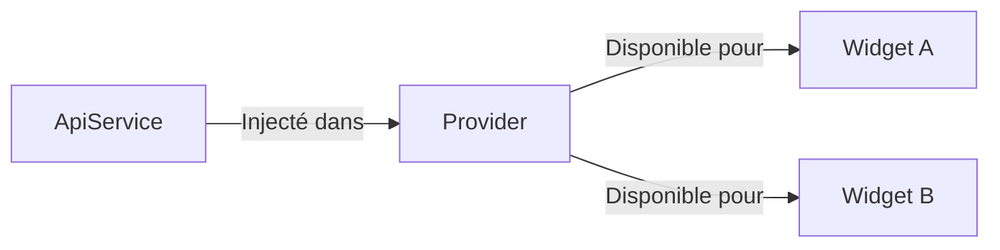

# 4-1-3 Injection de dépendances simple

L'injection de dépendances (DI) est une technique permettant de fournir à un objet les services ou données dont il a besoin, plutôt que de les créer directement à l'intérieur de celui-ci. Avec `provider`, cette pratique devient native et très accessible.

## 1. Concept fondamental
Au lieu d'instancier un service (ex: `ApiService`) directement dans un widget, vous l'injectez via le `Provider`. Cela permet de découpler vos composants et de faciliter les tests unitaires en remplaçant facilement une implémentation réelle par une version "mock" (simulée).

## 2. Mise en œuvre avec Provider

### Injection d'un service
Utilisez `Provider` (sans `ChangeNotifier`) pour injecter des objets qui ne nécessitent pas de notification de changement, comme des services API ou des dépôts de données.

```dart
// Injection au sommet de l'arbre
Provider<ApiService>(
  create: (context) => ApiService(),
  child: MyApp(),
);
```

### Accès au service
Dans n'importe quel widget enfant, vous récupérez l'instance sans avoir à la passer via les constructeurs.

```dart
final apiService = Provider.of<ApiService>(context, listen: false);
apiService.fetchData();
```

## 3. Comparatif : Instanciation vs Injection

| Approche | Dépendance | Testabilité |
| :--- | :--- | :--- |
| **Instanciation directe** | Forte (Couplage) | Difficile |
| **Injection de dépendances** | Faible (Découplage) | Facile (Mocking) |

## 4. Cas d'usage professionnels
*   **Services API :** Injecter un client HTTP configuré (ex: `Dio` ou `http`) pour centraliser les headers d'authentification.
*   **Dépôts (Repositories) :** Injecter une couche d'abstraction entre la base de données locale et l'interface utilisateur.
*   **Configuration :** Injecter des clés d'API ou des paramètres d'environnement.

## 5. Bonnes pratiques professionnelles
*   **Utilisez `listen: false` :** Pour les services qui ne changent jamais (comme un `ApiService`), utilisez toujours `listen: false` lors de la récupération. Cela évite des reconstructions inutiles du widget.
*   **Interfaces (Abstract classes) :** Injectez des interfaces plutôt que des classes concrètes. Cela permet de basculer entre une implémentation `ProductionApiService` et `MockApiService` sans modifier le code des widgets.
*   **MultiProvider :** Pour injecter plusieurs services, utilisez `MultiProvider` afin d'éviter l'imbrication profonde de widgets.

```dart
MultiProvider(
  providers: [
    Provider<ApiService>(create: (_) => ApiService()),
    Provider<AuthRepository>(create: (_) => AuthRepository()),
  ],
  child: MyApp(),
);
```

## 6. Erreurs fréquentes et points de vigilance
*   **Cycle de vie :** Un objet injecté via `Provider` est créé lors de l'insertion du widget dans l'arbre. Si le widget est retiré, l'objet est détruit. Assurez-vous que le `Provider` est placé assez haut pour survivre aux changements de routes.
*   **Accès hors contexte :** Vous ne pouvez pas accéder à un `Provider` en dehors d'un contexte de widget (ex: dans une classe métier pure). Pour ces cas, utilisez des solutions comme `get_it` pour une injection de dépendances globale.

## 7. Flux de dépendances



## Sources
*   [Pub.dev - Provider package documentation](https://pub.dev/packages/provider)
*   [Flutter Documentation - Dependency Injection](https://docs.flutter.dev/testing/common-testing-mistakes#dependency-injection)