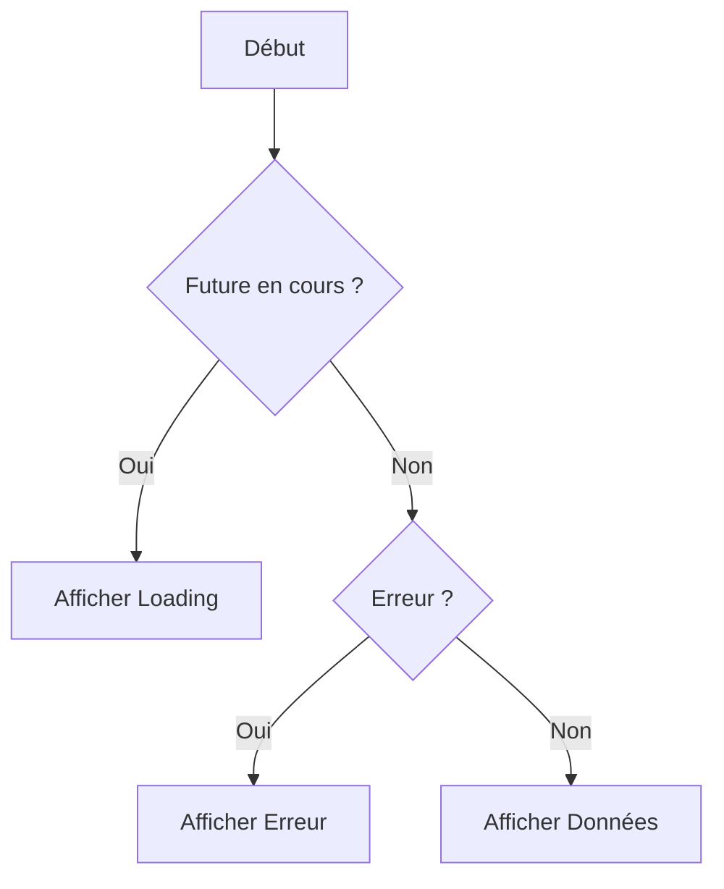

# 5-1-3 Le widget FutureBuilder pour gérer les états de chargement/erreur

Le widget `FutureBuilder` est un outil puissant pour connecter l'interface utilisateur (UI) à des opérations asynchrones. Il permet de reconstruire automatiquement l'UI en fonction de l'état d'un `Future` (en attente, terminé avec succès, ou en erreur).

## 1. Concept fondamental
`FutureBuilder` écoute un `Future` et exécute une fonction `builder` à chaque changement d'état. Il élimine le besoin de gérer manuellement des variables d'état (`isLoading`, `errorMessage`, `data`) dans un `StatefulWidget`.

## 2. Fonctionnement détaillé
Le `FutureBuilder` prend deux paramètres principaux :
*   `future` : L'opération asynchrone à surveiller.
*   `builder` : Une fonction qui reçoit le `context` et un `AsyncSnapshot`.

L'objet `AsyncSnapshot` contient l'état actuel de la requête :
*   `connectionState` : Indique si la requête est `waiting`, `active` ou `done`.
*   `hasError` : Booléen indiquant si une erreur est survenue.
*   `data` : Les données récupérées en cas de succès.

```dart
FutureBuilder<User>(
  future: _userService.fetchUser(),
  builder: (context, snapshot) {
    if (snapshot.connectionState == ConnectionState.waiting) {
      return const CircularProgressIndicator();
    } else if (snapshot.hasError) {
      return Text('Erreur : ${snapshot.error}');
    } else if (snapshot.hasData) {
      return Text('Utilisateur : ${snapshot.data!.name}');
    }
    return const SizedBox.shrink();
  },
)
```

## 3. États de connexion (ConnectionState)

| État | Signification | UI typique |
| :--- | :--- | :--- |
| `none` | Aucun futur n'est assigné | Widget vide |
| `waiting` | Opération en cours | Indicateur de chargement |
| `active` | Opération en cours (pour les Streams) | N/A |
| `done` | Opération terminée | Affichage des données ou erreur |

## 4. Bonnes pratiques professionnelles
*   **Ne pas créer le Future dans le builder :** Le `Future` doit être créé dans `initState` ou passé via un constructeur. Si vous le créez directement dans `build`, le `Future` sera relancé à chaque reconstruction du widget, provoquant des appels API en boucle.
*   **Gestion des erreurs :** Affichez toujours un message d'erreur explicite ou un bouton "Réessayer" pour améliorer l'expérience utilisateur.
*   **Utilisation de `SizedBox.shrink()` :** Utilisez ce widget pour retourner un élément vide si aucun état ne correspond, plutôt que `null`.

## 5. Erreurs fréquentes
*   **Reconstruction infinie :** Oublier de stocker le `Future` dans une variable et le recréer à chaque `build`.
*   **Ignorer les états :** Ne pas gérer `snapshot.hasError` peut laisser l'utilisateur face à un écran figé en cas de problème réseau.
*   **Complexité excessive :** Si la logique de gestion d'état devient trop lourde, le `FutureBuilder` devient difficile à lire. Dans ce cas, passez à une gestion d'état plus robuste (ex: `Provider` avec `ChangeNotifier`).

## 6. Cycle de vie du FutureBuilder



## 7. Recommandation actuelle
Le `FutureBuilder` est excellent pour des composants UI isolés et simples. Pour des écrans complexes impliquant plusieurs appels API ou une logique métier riche, préférez l'utilisation d'un `ChangeNotifier` (via `Provider`) qui offre une meilleure séparation des préoccupations et une testabilité accrue.

## Sources
*   [Flutter Documentation - FutureBuilder class](https://api.flutter.dev/flutter/widgets/FutureBuilder-class.html)
*   [Flutter Documentation - Asynchronous UI](https://docs.flutter.dev/cookbook/networking/fetch-data)