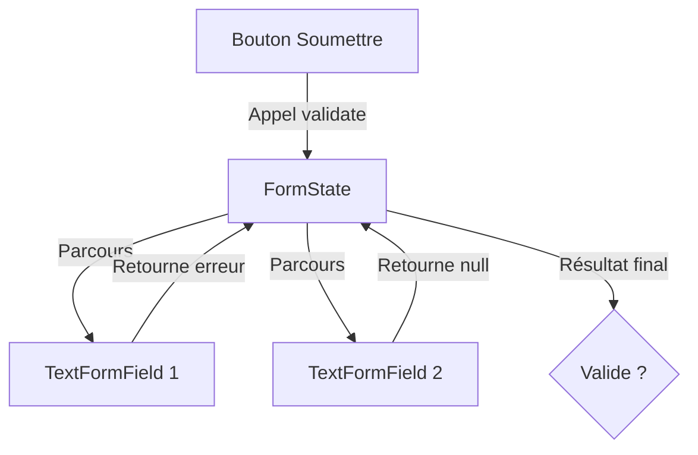

# 6-1-1 Widgets Form, TextFormField et GlobalKey

La saisie de données utilisateur nécessite de gérer l'état, la validation et la soumission. Flutter propose un système intégré basé sur trois composants clés : `Form`, `TextFormField` et `GlobalKey`.

## 1. Concepts fondamentaux

*   **Form :** Un conteneur qui regroupe plusieurs champs de saisie. Il permet de valider, sauvegarder ou réinitialiser tous les champs enfants simultanément.
*   **TextFormField :** Un widget de saisie de texte spécialisé qui s'intègre nativement au widget `Form`. Il possède une propriété `validator` pour définir les règles de validation.
*   **GlobalKey<FormState> :** Une clé unique permettant d'accéder à l'état du formulaire (`FormState`) depuis n'importe où dans le widget, afin de déclencher les méthodes de validation ou de sauvegarde.

## 2. Mise en œuvre

### Structure de base
```dart
final _formKey = GlobalKey<FormState>();

Form(
  key: _formKey,
  child: Column(
    children: [
      TextFormField(
        validator: (value) {
          if (value == null || value.isEmpty) return 'Champ requis';
          return null;
        },
      ),
      ElevatedButton(
        onPressed: () {
          if (_formKey.currentState!.validate()) {
            // Le formulaire est valide
          }
        },
        child: const Text('Soumettre'),
      ),
    ],
  ),
)
```

## 3. Fonctionnement détaillé

1.  **Enregistrement :** Chaque `TextFormField` s'enregistre automatiquement auprès du `Form` parent via la `GlobalKey`.
2.  **Validation :** Lors de l'appel à `_formKey.currentState!.validate()`, le `Form` parcourt tous ses `TextFormField` enfants et exécute leurs fonctions `validator`.
3.  **Feedback :** Si un validateur retourne une chaîne de caractères, le champ affiche cette erreur sous le champ de saisie. Si le validateur retourne `null`, le champ est considéré comme valide.

## 4. Comparatif : TextField vs TextFormField

| Caractéristique | TextField | TextFormField |
| :--- | :--- | :--- |
| **Intégration Form** | Non | Oui |
| **Validation native** | Non | Oui (`validator`) |
| **Sauvegarde native** | Non | Oui (`onSaved`) |
| **Usage** | Recherche simple, filtre | Inscription, Login, Profil |

## 5. Bonnes pratiques professionnelles

*   **Gestion des données :** Utilisez `onSaved` pour transférer les valeurs saisies vers un objet métier (ex: un modèle `User`) une fois la validation réussie.
*   **Feedback utilisateur :** Utilisez `autovalidateMode` sur le `Form` pour déclencher la validation dès que l'utilisateur commence à taper (`AutovalidateMode.onUserInteraction`).
*   **Clavier adapté :** Configurez `keyboardType` (ex: `TextInputType.emailAddress`, `TextInputType.number`) pour améliorer l'expérience utilisateur.
*   **Sécurité :** Pour les mots de passe, utilisez `obscureText: true` et `enableSuggestions: false`.

## 6. Erreurs fréquentes et points de vigilance

*   **Oubli de la clé :** Si la `GlobalKey` n'est pas passée au widget `Form`, les méthodes `validate()` ou `save()` ne fonctionneront pas.
*   **Validation bloquante :** Ne réalisez pas d'opérations asynchrones lourdes (ex: appel API) directement dans le `validator`. La validation doit être synchrone et rapide.
*   **Cycle de vie :** La `GlobalKey` doit être définie comme une propriété de l'état du widget (`State`) et non recréée à chaque méthode `build`.

## 7. Flux de validation



## Sources
*   [Flutter Documentation - Building a Form with Validation](https://docs.flutter.dev/cookbook/forms/validation)
*   [Flutter API - Form class](https://api.flutter.dev/flutter/widgets/Form-class.html)