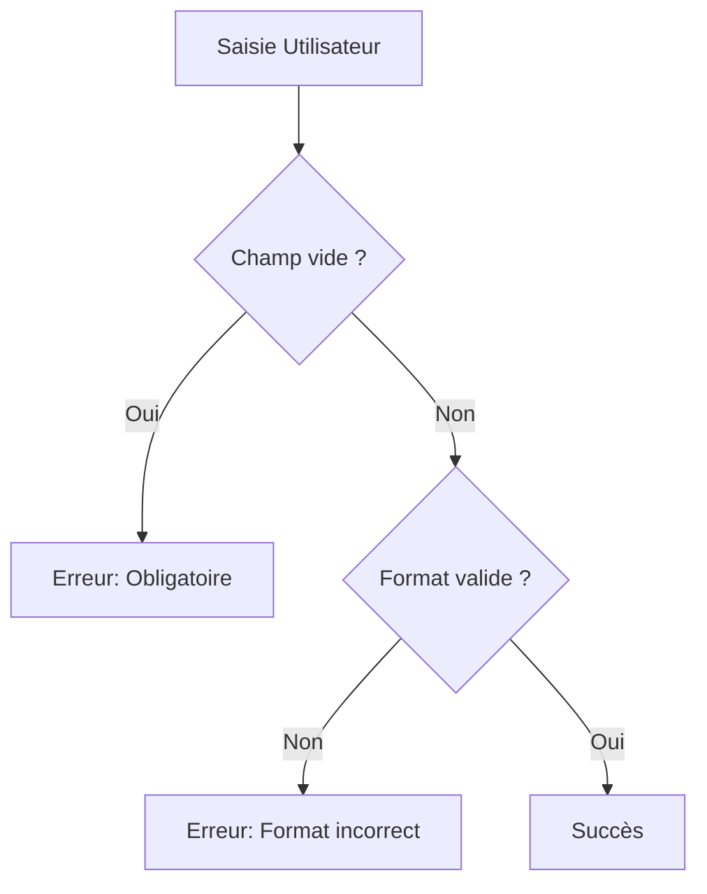

# 6-1-2 Logique de validation (Regex, longueur, champs obligatoires)

La validation des données saisies par l'utilisateur est une étape indispensable pour garantir l'intégrité des données envoyées à votre backend. Elle s'effectue principalement via la propriété `validator` du widget `TextFormField`.

## 1. Concepts fondamentaux
La fonction `validator` reçoit la valeur actuelle du champ sous forme de `String?`.
*   Si elle retourne `null`, la validation est réussie.
*   Si elle retourne une `String` (le message d'erreur), la validation échoue et le message s'affiche sous le champ.

## 2. Techniques de validation courantes

### Champs obligatoires
La vérification la plus simple consiste à s'assurer que la chaîne n'est pas vide.

```dart
validator: (value) {
  if (value == null || value.trim().isEmpty) {
    return 'Ce champ est obligatoire';
  }
  return null;
}
```

### Longueur minimale et maximale
Utile pour les mots de passe ou les noms d'utilisateur.

```dart
validator: (value) {
  if (value != null && value.length < 8) {
    return 'Minimum 8 caractères requis';
  }
  return null;
}
```

### Expressions régulières (Regex)
Les Regex permettent de valider des formats complexes comme les emails ou les numéros de téléphone.

```dart
final emailRegex = RegExp(r'^[\w-\.]+@([\w-]+\.)+[\w-]{2,4}$');

validator: (value) {
  if (value == null || !emailRegex.hasMatch(value)) {
    return 'Format email invalide';
  }
  return null;
}
```

## 3. Synthèse des cas d'usage

| Type de donnée | Règle de validation |
| :--- | :--- |
| **Nom / Prénom** | Non vide, longueur min 2 |
| **Email** | Regex standard |
| **Mot de passe** | Longueur min, présence de chiffres/caractères spéciaux |
| **Code Postal** | Regex numérique (ex: `^\d{5}$`) |

## 4. Bonnes pratiques professionnelles
*   **Centralisation :** Créez une classe utilitaire `Validators` contenant des méthodes statiques réutilisables pour éviter la duplication de code.
*   **Trim :** Utilisez toujours `.trim()` sur les entrées utilisateur pour ignorer les espaces inutiles au début ou à la fin de la saisie.
*   **Messages clairs :** Fournissez des messages d'erreur explicites qui indiquent à l'utilisateur comment corriger son erreur.
*   **Validation côté serveur :** La validation côté client est une aide à l'ergonomie. Elle ne remplace jamais la validation côté serveur, qui est la seule garante de la sécurité des données.

## 5. Exemple de classe utilitaire

```dart
class Validators {
  static String? email(String? value) {
    final regex = RegExp(r'^[\w-\.]+@([\w-]+\.)+[\w-]{2,4}$');
    if (value == null || !regex.hasMatch(value)) return 'Email invalide';
    return null;
  }
}

// Utilisation
TextFormField(validator: Validators.email)
```

## 6. Erreurs fréquentes et points de vigilance
*   **Regex complexes :** Évitez les Regex trop complexes qui peuvent devenir illisibles et difficiles à maintenir. Si une règle est trop complexe, décomposez-la en plusieurs étapes de validation.
*   **Validation trop stricte :** Ne bloquez pas des saisies valides par excès de zèle (ex: interdire certains caractères spéciaux dans un nom de famille).
*   **Performance :** Bien que la validation soit rapide, évitez les calculs intensifs dans le `validator` car il est appelé fréquemment lors de la saisie si `autovalidateMode` est activé.

## 7. Flux de décision de validation



---

## 8. Comment l'activer `autovalidateMode` ?

Pour l'activer, vous devez passer l'une des valeurs de l'enum `AutovalidateMode` à la propriété `autovalidateMode` :

* Soit au niveau du **`Form`** (s'applique à tous les champs enfants).
* Soit au niveau d'un **`TextFormField`** spécifique.

#### Les 2 modes disponibles :

1. **`AutovalidateMode.onUserInteraction` (Recommandé pour la UX)**
La validation se déclenche **uniquement après la première interaction** de l'utilisateur avec le champ (lorsqu'il commence à taper ou perd le focus). Cela évite d'afficher des erreurs rouges sur un formulaire vierge au premier affichage.
2. **`AutovalidateMode.always`**
La validation s'exécute dès l'affichage du widget, puis à chaque reconstruction d'UI. À utiliser avec précaution, car il affiche immédiatement les messages d'erreur sur des champs que l'utilisateur n'a pas encore eu le temps de remplir.

---

### Exemples de code

#### 1. Sur un champ individuel

```dart
TextFormField(
  controller: _emailController,
  // Valide automatiquement dès que l'utilisateur commence à saisir
  autovalidateMode: AutovalidateMode.onUserInteraction,
  validator: (value) {
    if (value == null || value.isEmpty) return 'Champ obligatoire';
    return null;
  },
)

```

#### 2. Globalement sur tout le Formulaire

```dart
Form(
  key: _formKey,
  // S'applique à tous les TextFormField enfants
  autovalidateMode: AutovalidateMode.onUserInteraction,
  child: Column(
    children: [
      TextFormField(...),
      TextFormField(...),
    ],
  ),
)

```

> **Attention avec la validation asynchrone (ex. vérification d'email unique) :** Activer `AutovalidateMode.onUserInteraction` ou `always` réexécute le `validator` à chaque frappe de touche. Si vous effectuez un traitement lourd ou déclenchez des timers de debounce dans le `validator`, ces modes peuvent générer des comportements inattendus. Conservez la logique asynchrone dans un `onChanged` dédié.

---

## Sources
*   [Dart Documentation - RegExp class](https://api.dart.dev/stable/dart-core/RegExp-class.html)
*   [Flutter Cookbook - Form Validation](https://docs.flutter.dev/cookbook/forms/validation)