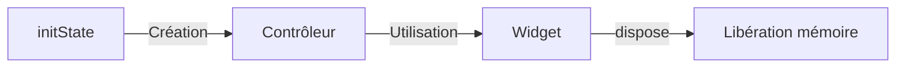

# 6-1-3 Gestion des contrôleurs (TextEditingController)

Le `TextEditingController` est l'objet qui permet de contrôler, lire et modifier le contenu d'un champ de texte (`TextField` ou `TextFormField`) de manière impérative.

## 1. Concepts fondamentaux
Contrairement à la validation qui est déclarative, le contrôleur offre un accès direct à la valeur saisie. Il permet de :
*   Récupérer la valeur actuelle (`controller.text`).
*   Définir une valeur par défaut ou modifier le texte par programmation.
*   Écouter les changements en temps réel.

## 2. Mise en œuvre
Un contrôleur doit être instancié dans le `State` d'un widget et, surtout, **libéré** lors de la destruction du widget pour éviter les fuites de mémoire.

```dart
class MyForm extends StatefulWidget {
  @override
  _MyFormState createState() => _MyFormState();
}

class _MyFormState extends State<MyForm> {
  final _controller = TextEditingController();

  @override
  void dispose() {
    _controller.dispose(); // Libération obligatoire
    super.dispose();
  }

  @override
  Widget build(BuildContext context) {
    return TextFormField(controller: _controller);
  }
}
```

## 3. Fonctionnalités avancées

### Écouter les changements
Vous pouvez attacher un écouteur pour réagir à chaque frappe clavier :
```dart
_controller.addListener(() {
  print('Valeur actuelle : ${_controller.text}');
});
```

### Manipulation du curseur
Le contrôleur permet de gérer la position du curseur ou de sélectionner du texte :
```dart
_controller.selection = TextSelection.collapsed(offset: _controller.text.length);
```

## 4. Comparatif : `onChanged` vs `TextEditingController`

| Caractéristique | `onChanged` | `TextEditingController` |
| :--- | :--- | :--- |
| **Approche** | Réactive (callback) | Impérative (accès direct) |
| **Complexité** | Faible | Moyenne |
| **Cas d'usage** | Mise à jour d'état simple | Manipulation complexe, accès externe |
| **Performance** | Légère | Légère |

## 5. Bonnes pratiques professionnelles
*   **Dispose systématiquement :** L'oubli du `.dispose()` est une cause fréquente de fuites de mémoire dans les applications Flutter.
*   **Utilisation ciblée :** N'utilisez un contrôleur que si vous avez besoin de manipuler le texte en dehors de la simple récupération lors de la soumission. Pour un formulaire classique, `onSaved` ou `onChanged` suffisent souvent.
*   **Initialisation :** Si vous devez pré-remplir un champ (ex: modification de profil), passez la valeur initiale via le constructeur du contrôleur : `TextEditingController(text: 'Valeur initiale')`.

## 6. Erreurs fréquentes et points de vigilance
*   **Réinitialisation du curseur :** Modifier la propriété `.text` d'un contrôleur déplace souvent le curseur au début du champ. Si vous mettez à jour le texte dynamiquement, vous devez gérer manuellement la position du curseur.
*   **Conflit avec `initialValue` :** Vous ne pouvez pas utiliser `initialValue` dans un `TextFormField` si vous lui avez déjà assigné un `controller`. Le contrôleur prend le pas sur la propriété.
*   **Reconstruction :** Ne créez jamais un `TextEditingController` directement dans la méthode `build`. Il sera recréé à chaque reconstruction, perdant ainsi le focus et le texte saisi.

## 7. Cycle de vie du contrôleur



## Sources
*   [Flutter API - TextEditingController class](https://api.flutter.dev/flutter/widgets/TextEditingController-class.html)
*   [Flutter Documentation - Handling changes to a text field](https://docs.flutter.dev/cookbook/forms/text-field-changes)