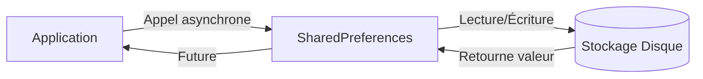

# 7-1-1 Utilisation du package SharedPreferences

Le package `shared_preferences` est la solution standard dans l'écosystème Flutter pour stocker de petites quantités de données persistantes sous forme de paires clé-valeur.

## 1. Concepts fondamentaux
`SharedPreferences` permet de sauvegarder des données simples (booléens, entiers, doubles, chaînes de caractères et listes de chaînes) sur le disque de l'appareil. Ces données persistent même après la fermeture ou le redémarrage de l'application.

## 2. Fonctionnement détaillé
L'accès au stockage est asynchrone. Vous devez obtenir une instance de `SharedPreferences` avant de pouvoir lire ou écrire des données.

### Lecture et écriture
```dart
import 'package:shared_preferences/shared_preferences.dart';

// Écriture
final prefs = await SharedPreferences.getInstance();
await prefs.setInt('counter', 42);

// Lecture
final int? counter = prefs.getInt('counter');
```

## 3. Cas d'usage
*   **Préférences utilisateur :** Thème sombre/clair, langue choisie.
*   **État de session :** Mémoriser si l'utilisateur est déjà connecté (token d'authentification).
*   **Configuration :** Activation/désactivation de notifications, tutoriel déjà vu.

## 4. Avantages et limites

| Avantages | Limites |
| :--- | :--- |
| Simple à mettre en œuvre | Uniquement pour des données simples |
| Persistance native | Non sécurisé pour les données sensibles |
| Rapide pour de petits volumes | Pas de requêtes complexes (pas de SQL) |

## 5. Bonnes pratiques professionnelles
*   **Injection de dépendances :** Ne pas appeler `SharedPreferences.getInstance()` partout dans le code. Initialisez-le une fois au démarrage de l'application et injectez l'instance dans vos services.
*   **Clés constantes :** Définissez vos clés de stockage comme des constantes (`static const String keyUserToken = 'user_token';`) pour éviter les erreurs de frappe.
*   **Données sensibles :** N'utilisez **jamais** `SharedPreferences` pour stocker des mots de passe ou des clés API privées. Utilisez des solutions sécurisées comme `flutter_secure_storage` pour ces cas.

## 6. Erreurs fréquentes et points de vigilance
*   **Blocage de l'UI :** Bien que l'accès soit rapide, les opérations sont asynchrones. Assurez-vous de toujours utiliser `await` pour éviter des comportements imprévisibles.
*   **Volume de données :** Si vous commencez à stocker des listes complexes ou des objets JSON volumineux, passez à une base de données locale comme `sqflite` ou `isar`.
*   **Gestion des types :** `SharedPreferences` est typé. Tenter de lire une clé avec le mauvais type (ex: `getInt` sur une clé contenant une `String`) retournera `null` ou provoquera une erreur.

## 7. Flux de persistance



## 8. Recommandations actuelles
Pour les applications modernes, il est recommandé de créer une couche d'abstraction (un service) autour de `SharedPreferences`. Cela permet de changer facilement de technologie de stockage à l'avenir sans modifier le reste de votre code métier.

## Sources
*   [Pub.dev - shared_preferences package](https://pub.dev/packages/shared_preferences)
*   [Flutter Documentation - Persisting data](https://docs.flutter.dev/cookbook/persistence/key-value)