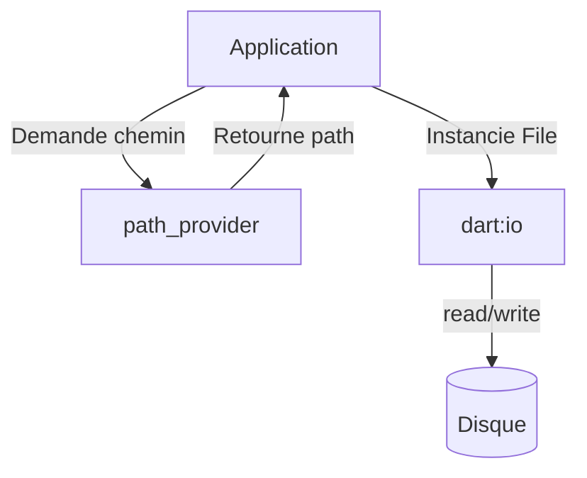

# 7-1-2 Stockage de fichiers simples sur le disque

Pour stocker des données plus volumineuses ou structurées (JSON, logs, images) que ce que permettent les préférences, Flutter utilise le système de fichiers local via le package `path_provider` et la bibliothèque `dart:io`.

## 1. Concepts fondamentaux
Le système de fichiers est organisé en répertoires accessibles par l'application :
*   **Application Documents Directory :** Répertoire privé de l'application, idéal pour les données créées par l'utilisateur.
*   **Temporary Directory :** Répertoire pour les fichiers cache qui peuvent être supprimés par le système à tout moment.

## 2. Fonctionnement détaillé
La manipulation de fichiers nécessite trois étapes :
1.  **Localisation :** Trouver le chemin du répertoire avec `path_provider`.
2.  **Accès :** Créer une instance de `File` avec `dart:io`.
3.  **Opération :** Lire ou écrire le contenu.

```dart
import 'dart:io';
import 'package:path_provider/path_provider.dart';

Future<String> get _localPath async {
  final directory = await getApplicationDocumentsDirectory();
  return directory.path;
}

Future<File> get _localFile async {
  final path = await _localPath;
  return File('$path/data.txt');
}

// Écriture
Future<File> writeData(String data) async {
  final file = await _localFile;
  return file.writeAsString(data);
}

// Lecture
Future<String> readData() async {
  final file = await _localFile;
  return await file.readAsString();
}
```

## 3. Comparatif : SharedPreferences vs Fichiers

| Caractéristique | SharedPreferences | Fichiers (dart:io) |
| :--- | :--- | :--- |
| **Type de données** | Clé-valeur simple | Tout type (texte, binaire) |
| **Complexité** | Très faible | Moyenne |
| **Volume** | Petit (< 1 Mo) | Illimité (selon stockage) |
| **Structure** | Plate | Hiérarchique |

## 4. Cas d'usage
*   **Export de données :** Générer un fichier CSV ou JSON pour un rapport.
*   **Cache d'images :** Stocker des images téléchargées pour éviter de les recharger.
*   **Logs d'erreurs :** Enregistrer des traces d'exécution pour le débogage.

## 5. Bonnes pratiques professionnelles
*   **Gestion des erreurs :** Enveloppez toujours les opérations de lecture/écriture dans des blocs `try-catch` pour gérer les problèmes d'accès disque ou de permissions.
*   **Asynchronisme :** Toutes les opérations sur le système de fichiers sont bloquantes pour le thread principal. Utilisez systématiquement les méthodes `async` pour maintenir la fluidité de l'interface.
*   **Nettoyage :** Si vous utilisez le répertoire temporaire, implémentez une logique pour purger les vieux fichiers afin de ne pas saturer l'espace disque de l'utilisateur.

## 6. Erreurs fréquentes et points de vigilance
*   **Chemins codés en dur :** N'utilisez jamais de chemins absolus (ex: `/data/user/...`). Utilisez toujours les méthodes de `path_provider` pour obtenir les chemins dynamiquement selon l'OS.
*   **Concurrence :** Évitez d'écrire dans le même fichier depuis plusieurs endroits simultanément. Cela peut corrompre les données.
*   **Permissions :** Sur Android et iOS, l'accès aux répertoires de l'application ne nécessite pas de permissions spéciales. Si vous accédez à des répertoires publics (ex: galerie photo), vous devrez configurer les permissions dans `AndroidManifest.xml` ou `Info.plist`.

## 7. Flux de travail avec les fichiers



## Sources
*   [Pub.dev - path_provider package](https://pub.dev/packages/path_provider)
*   [Dart Documentation - dart:io File class](https://api.dart.dev/stable/dart-io/File-class.html)