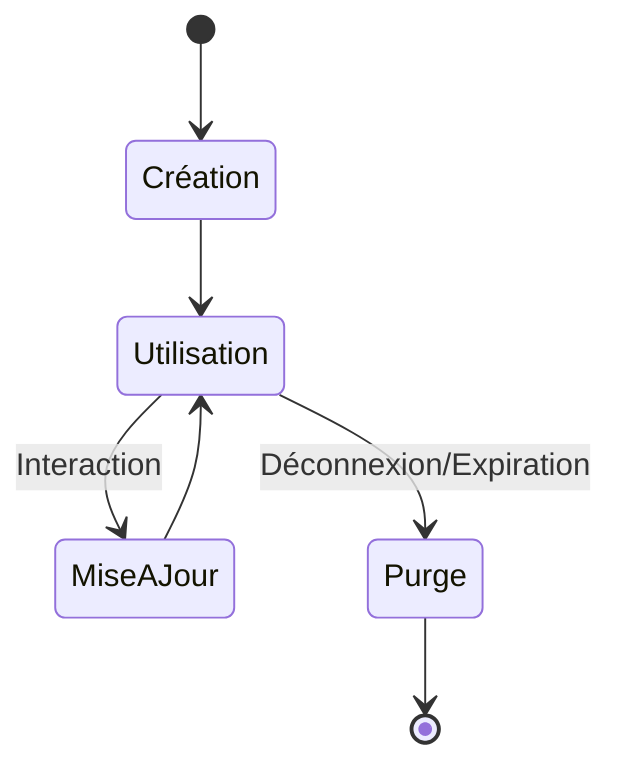

# 7-1-3 Cycle de vie des données locales

La gestion du cycle de vie des données est le processus consistant à définir quand les données sont créées, mises à jour, persistées et supprimées. Une mauvaise gestion entraîne une accumulation de données inutiles (le "junk data") et des problèmes de confidentialité.

## 1. Concepts fondamentaux
Le cycle de vie des données locales suit généralement ces phases :
*   **Initialisation :** Création ou récupération des données lors du premier lancement.
*   **Persistance :** Sauvegarde des changements effectués par l'utilisateur.
*   **Synchronisation :** Mise à jour avec un serveur distant (si applicable).
*   **Purge :** Suppression des données obsolètes ou lors de la déconnexion.

## 2. Stratégies de gestion

### Données éphémères (Cache)
Ces données peuvent être recréées à partir d'une source distante. Elles doivent être stockées dans le répertoire temporaire et purgées régulièrement.

### Données persistantes (État utilisateur)
Ces données doivent survivre à la fermeture de l'application. Elles sont stockées dans le répertoire des documents.

## 3. Cycle de vie et suppression

| Type de donnée | Stratégie de suppression |
| :--- | :--- |
| **Cache (images, API)** | Purge automatique si espace disque faible ou après X jours. |
| **Session (Token)** | Suppression lors de la déconnexion explicite. |
| **Préférences** | Conservation jusqu'à la désinstallation ou réinitialisation. |
| **Logs** | Rotation des fichiers (suppression des plus anciens). |

## 4. Bonnes pratiques professionnelles
*   **Déconnexion propre :** Lors d'une déconnexion, effacez systématiquement les données sensibles (`SharedPreferences`, bases de données locales, fichiers chiffrés).
*   **Gestion de l'espace disque :** Vérifiez l'espace disponible avant d'écrire de gros fichiers.
*   **Versionnage des données :** Si vous modifiez la structure de vos données (ex: ajout d'un champ dans un JSON), prévoyez une logique de migration pour éviter de corrompre les données existantes sur le téléphone de l'utilisateur.

## 5. Erreurs fréquentes et points de vigilance
*   **Données orphelines :** Oublier de supprimer les fichiers associés à un objet supprimé (ex: supprimer un profil utilisateur mais garder son avatar sur le disque).
*   **Persistance excessive :** Stocker des données qui devraient être re-téléchargées. Cela augmente la taille de l'application et peut rendre les données obsolètes.
*   **Non-respect de la vie privée :** Conserver des données personnelles après que l'utilisateur a supprimé son compte.

## 6. Exemple : Logique de déconnexion

```dart
Future<void> logout() async {
  final prefs = await SharedPreferences.getInstance();
  final cacheDir = await getTemporaryDirectory();
  
  // 1. Effacer les préférences
  await prefs.clear();
  
  // 2. Supprimer les fichiers temporaires
  if (cacheDir.existsSync()) {
    cacheDir.deleteSync(recursive: true);
  }
  
  // 3. Rediriger vers l'écran de login
}
```

## 7. Diagramme de cycle de vie



## 8. Recommandations actuelles
Pour les applications professionnelles, implémentez une politique de rétention des données. Si votre application traite des données soumises au RGPD, la capacité à supprimer toutes les données locales d'un utilisateur est une exigence légale.

## Sources
*   [Android Documentation - Data storage overview](https://developer.android.com/training/data-storage)
*   [Apple Documentation - File System Programming Guide](https://developer.apple.com/library/archive/documentation/FileManagement/Conceptual/FileSystemProgrammingGuide/Introduction/Introduction.html)