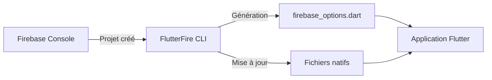

# 8-1-1 Configuration de Firebase Console et FlutterFire CLI

L'intégration de Firebase dans un projet Flutter est facilitée par l'outil **FlutterFire CLI**, qui automatise la configuration spécifique à chaque plateforme (Android, iOS, Web).

## 1. Concepts fondamentaux
*   **Firebase Console :** L'interface web où vous créez votre projet, gérez les services (Auth, Firestore, etc.) et configurez les accès.
*   **FlutterFire CLI :** Un outil en ligne de commande qui génère automatiquement les fichiers de configuration nécessaires (`firebase_options.dart`) et configure les fichiers natifs (`google-services.json` pour Android, `GoogleService-Info.plist` pour iOS).

## 2. Fonctionnement détaillé

### Prérequis
1.  Avoir installé [Firebase CLI](https://firebase.google.com/docs/cli) sur votre machine.
2.  Être connecté via `firebase login`.

### Processus d'installation
Le flux de travail standard consiste à exécuter la commande suivante à la racine de votre projet :

```bash
dart pub global activate flutterfire_cli
flutterfire configure
```

Cette commande effectue les actions suivantes :
1.  Sélection du projet Firebase dans la console.
2.  Sélection des plateformes cibles (Android, iOS, macOS, Web).
3.  Génération du fichier `lib/firebase_options.dart` contenant les clés API et identifiants.
4.  Mise à jour des fichiers de configuration natifs.

## 3. Initialisation dans le code
Une fois configuré, vous devez initialiser Firebase au démarrage de l'application :

```dart
void main() async {
  WidgetsFlutterBinding.ensureInitialized();
  await Firebase.initializeApp(
    options: DefaultFirebaseOptions.currentPlatform,
  );
  runApp(MyApp());
}
```

## 4. Avantages et limites

| Avantages | Limites |
| :--- | :--- |
| Automatisation complète | Nécessite l'installation de Node.js/Firebase CLI |
| Moins d'erreurs manuelles | Dépendance à la connexion internet |
| Gestion multi-plateforme simplifiée | Configuration initiale parfois complexe |

## 5. Bonnes pratiques professionnelles
*   **Environnements multiples :** Utilisez des projets Firebase distincts pour le développement, le staging et la production. La CLI permet de configurer plusieurs environnements facilement.
*   **Gestion des secrets :** Le fichier `firebase_options.dart` contient des clés publiques. Bien qu'elles ne soient pas secrètes par nature, évitez de les modifier manuellement.
*   **Versionnage :** Ajoutez `firebase_options.dart` à votre gestionnaire de version (Git).

## 6. Erreurs fréquentes et points de vigilance
*   **Oubli de `ensureInitialized` :** L'initialisation de Firebase nécessite que le binding Flutter soit prêt. Toujours appeler `WidgetsFlutterBinding.ensureInitialized()` avant `initializeApp`.
*   **Conflits de configuration :** Si vous modifiez manuellement les fichiers natifs (`AndroidManifest.xml`, `Info.plist`), la CLI peut écraser vos changements. Privilégiez toujours la CLI.
*   **Projets non synchronisés :** Assurez-vous que le projet sélectionné dans la CLI correspond bien à l'environnement souhaité.

## 7. Flux d'intégration



## 8. Recommandations actuelles
Utilisez toujours la version la plus récente de `flutterfire_cli` pour bénéficier des dernières améliorations de sécurité et de compatibilité avec les nouvelles versions d'iOS et Android. Vérifiez régulièrement les mises à jour avec `dart pub global activate flutterfire_cli`.

## Sources
*   [Firebase Documentation - Add Firebase to Flutter](https://firebase.google.com/docs/flutter/setup)
*   [FlutterFire CLI Documentation](https://firebase.flutter.dev/docs/cli/)