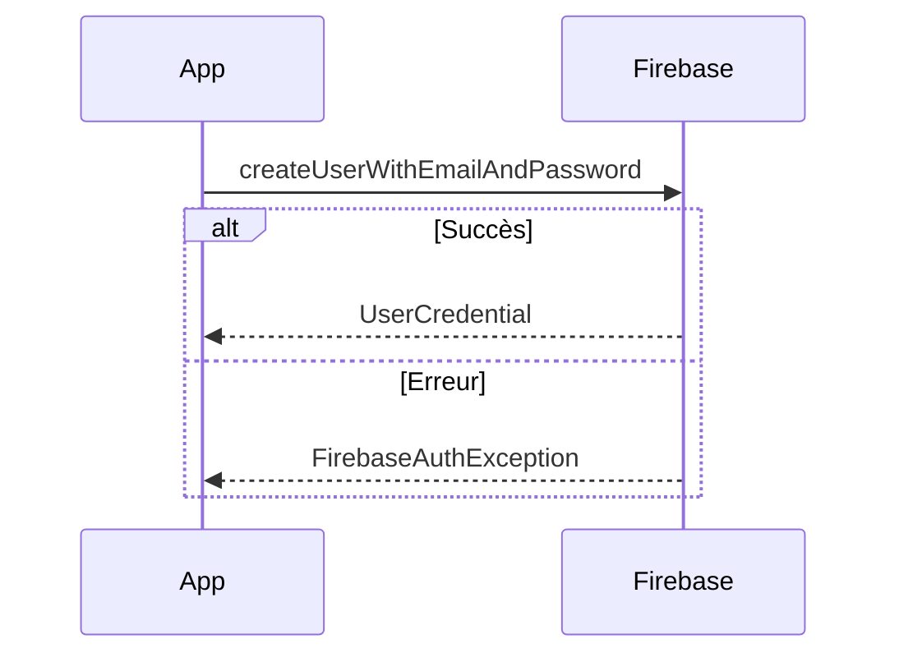

# 8-1-2 Firebase Auth : Connexion email/mot de passe

Firebase Authentication fournit un système complet pour gérer l'identité des utilisateurs. La méthode email/mot de passe est la plus courante pour les applications nécessitant une identification classique.

## 1. Concepts fondamentaux
*   **Auth Instance :** Le point d'entrée pour toutes les opérations d'authentification.
*   **UserCredential :** L'objet retourné après une authentification réussie, contenant les informations de l'utilisateur.
*   **FirebaseAuthException :** La classe d'exception spécifique pour gérer les erreurs (email invalide, mot de passe faible, utilisateur déjà existant).

## 2. Fonctionnement détaillé

### Inscription
```dart
try {
  await FirebaseAuth.instance.createUserWithEmailAndPassword(
    email: email,
    password: password,
  );
} on FirebaseAuthException catch (e) {
  // Gestion des erreurs (ex: weak-password, email-already-in-use)
}
```

### Connexion
```dart
try {
  await FirebaseAuth.instance.signInWithEmailAndPassword(
    email: email,
    password: password,
  );
} on FirebaseAuthException catch (e) {
  // Gestion des erreurs (ex: user-not-found, wrong-password)
}
```

## 3. Gestion de l'état de connexion
Utilisez `authStateChanges()` pour écouter les changements d'état de l'utilisateur en temps réel et mettre à jour l'interface (ex: rediriger vers la page d'accueil après connexion).

```dart
FirebaseAuth.instance.authStateChanges().listen((User? user) {
  if (user == null) {
    print('Utilisateur déconnecté');
  } else {
    print('Utilisateur connecté : ${user.uid}');
  }
});
```

## 4. Avantages et limites

| Avantages | Limites |
| :--- | :--- |
| Mise en œuvre rapide | Nécessite une gestion des emails (vérification) |
| Sécurité gérée par Google | Risque de phishing si non couplé à la MFA |
| Intégration native Flutter | Pas de récupération de mot de passe sans configuration SMTP |

## 5. Bonnes pratiques professionnelles
*   **Validation côté client :** Validez le format de l'email et la complexité du mot de passe avant d'envoyer la requête à Firebase pour économiser des appels API.
*   **Gestion des erreurs :** Traduisez les codes d'erreur Firebase (`e.code`) pour afficher des messages compréhensibles par l'utilisateur final.
*   **Sécurité :** Activez la vérification d'email dans la console Firebase pour éviter les comptes frauduleux.

## 6. Erreurs fréquentes et points de vigilance
*   **Stockage des credentials :** Ne stockez jamais l'email ou le mot de passe en clair dans `SharedPreferences`. Firebase gère automatiquement la persistance de la session de manière sécurisée.
*   **Gestion du chargement :** Affichez un indicateur de chargement (`CircularProgressIndicator`) pendant l'exécution des méthodes `async` pour éviter que l'utilisateur ne clique plusieurs fois.
*   **Mots de passe faibles :** Firebase rejette par défaut les mots de passe de moins de 6 caractères.

## 7. Flux d'authentification



## 8. Recommandations actuelles
Pour les applications professionnelles, il est recommandé d'implémenter la **Multi-Factor Authentication (MFA)** disponible dans Firebase Auth pour renforcer la sécurité des comptes. Assurez-vous également de configurer correctement les règles de sécurité Firestore pour restreindre l'accès aux données aux seuls utilisateurs authentifiés.

## Sources
*   [Firebase Documentation - Authenticate with Email and Password](https://firebase.google.com/docs/auth/flutter/password-auth)
*   [FlutterFire - FirebaseAuth API Reference](https://firebase.flutter.dev/docs/auth/usage/)