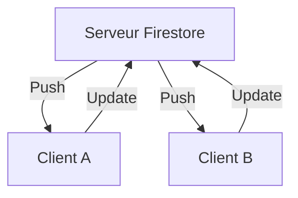

# 8-1-3 Aperçu de Cloud Firestore pour le stockage temps réel

Cloud Firestore est une base de données NoSQL orientée documents, hébergée dans le cloud, qui permet de synchroniser les données entre les clients en temps réel.

## 1. Concepts fondamentaux
*   **Collection :** Un conteneur regroupant des documents (ex: `users`, `products`).
*   **Document :** Une unité de stockage contenant des paires clé-valeur (JSON).
*   **Temps réel :** La capacité de l'application à recevoir des mises à jour instantanées dès qu'une donnée change sur le serveur, sans rafraîchissement manuel.

## 2. Fonctionnement détaillé

### Écriture de données
```dart
final db = FirebaseFirestore.instance;

await db.collection('tasks').add({
  'title': 'Terminer le rapport',
  'isDone': false,
  'createdAt': FieldValue.serverTimestamp(),
});
```

### Lecture en temps réel
```dart
db.collection('tasks').snapshots().listen((snapshot) {
  for (var doc in snapshot.docs) {
    print(doc.data());
  }
});
```

## 3. Avantages et limites

| Avantages | Limites |
| :--- | :--- |
| Synchronisation automatique | Coût lié au nombre de lectures/écritures |
| Mode hors-ligne natif | Requêtes complexes limitées (pas de jointures SQL) |
| Scalabilité automatique | Structure NoSQL exigeant une modélisation rigoureuse |

## 4. Cas d'usage
*   **Messagerie instantanée :** Affichage des nouveaux messages sans recharger la page.
*   **Tableaux de bord collaboratifs :** Mise à jour des données partagées entre plusieurs utilisateurs.
*   **Suivi de livraison :** Mise à jour de la position d'un colis en temps réel.

## 5. Bonnes pratiques professionnelles
*   **Modélisation :** Privilégiez la dénormalisation des données. Au lieu de faire des jointures, dupliquez les informations nécessaires dans les documents pour optimiser les lectures.
*   **Sécurité :** Utilisez les **Firestore Security Rules** pour restreindre l'accès aux données. Ne faites jamais confiance au client pour valider les permissions.
*   **Indexation :** Firestore crée automatiquement des index pour les requêtes simples. Pour les requêtes complexes (filtres multiples), vous devrez configurer des index composites dans la console Firebase.

## 6. Erreurs fréquentes et points de vigilance
*   **Lecture excessive :** Écouter toute une collection (`snapshots()`) peut coûter cher en lecture si la collection est volumineuse. Utilisez des filtres (`where`) pour ne récupérer que ce qui est nécessaire.
*   **Oubli de la gestion hors-ligne :** Firestore gère le cache local par défaut. Assurez-vous de comprendre comment les données sont synchronisées lors de la reconnexion.
*   **Structure de données plate :** Évitez les sous-collections trop profondes qui compliquent la récupération des données.

## 7. Flux de synchronisation



## 8. Recommandations actuelles
Pour les applications de production, surveillez votre consommation via le tableau de bord Firebase pour éviter les dépassements de quota. Utilisez le SDK Firebase pour Flutter avec les types génériques (`withConverter`) pour garantir la cohérence des données entre votre modèle Dart et Firestore.

## Sources
*   [Firebase Documentation - Cloud Firestore](https://firebase.google.com/docs/firestore)
*   [FlutterFire - Cloud Firestore Usage](https://firebase.flutter.dev/docs/firestore/usage/)