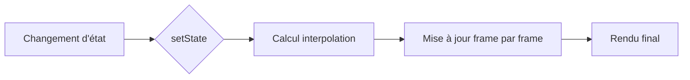

# 9-1-1 Animations implicites (AnimatedContainer, AnimatedOpacity)

Les animations implicites permettent de créer des transitions fluides entre deux états d'un widget sans avoir à gérer manuellement un `AnimationController`. Flutter calcule automatiquement l'interpolation entre les valeurs de début et de fin.

## 1. Concepts fondamentaux
*   **Widget implicite :** Widget qui anime automatiquement ses propriétés lorsqu'elles changent.
*   **Duration :** Temps nécessaire pour effectuer la transition.
*   **Curve :** Courbe de vitesse de l'animation (ex: `Curves.easeInOut`, `Curves.bounceOut`).

## 2. Fonctionnement détaillé
Lorsqu'une propriété d'un widget implicite change (via un `setState`), le widget compare l'ancienne valeur à la nouvelle et anime la transition sur la durée définie.

### Exemple : AnimatedContainer
```dart
AnimatedContainer(
  duration: Duration(milliseconds: 500),
  curve: Curves.easeInOut,
  width: _isExpanded ? 200 : 100,
  height: _isExpanded ? 200 : 100,
  color: _isExpanded ? Colors.blue : Colors.red,
  child: FlutterLogo(),
)
```

### Exemple : AnimatedOpacity
```dart
AnimatedOpacity(
  duration: Duration(seconds: 1),
  opacity: _isVisible ? 1.0 : 0.0,
  child: Text("Contenu masquable"),
)
```

## 3. Comparatif : Animations Implicites vs Explicites

| Caractéristique | Implicites | Explicites |
| :--- | :--- | :--- |
| **Complexité** | Faible | Élevée |
| **Contrôle** | Automatique | Manuel (Controller) |
| **Code** | Très concis | Verbeux |
| **Usage** | Transitions d'état simples | Séquences complexes, boucles |

## 4. Cas d'usage
*   **Feedback utilisateur :** Changement de couleur d'un bouton lors d'une validation.
*   **Expansion de contenu :** Agrandissement d'une carte (Card) pour afficher des détails.
*   **Apparition progressive :** Affichage d'un message d'erreur ou d'un loader.

## 5. Bonnes pratiques professionnelles
*   **Cohérence :** Utilisez une durée constante pour des animations similaires dans l'application afin de maintenir une identité visuelle cohérente.
*   **Courbes :** Privilégiez `Curves.easeInOut` pour la plupart des transitions, car elle offre un rendu naturel (accélération au début, décélération à la fin).
*   **Performance :** Les animations implicites sont optimisées par le moteur Flutter. Évitez de déclencher des animations trop fréquentes (ex: à chaque frame) pour ne pas surcharger le processeur.

## 6. Erreurs fréquentes et points de vigilance
*   **Oubli de `setState` :** L'animation ne se déclenchera pas si vous ne modifiez pas la valeur dans un `setState`.
*   **Durées trop longues :** Une animation dépassant 500ms peut donner une impression de lenteur à l'application.
*   **Conflits de propriétés :** Si vous changez plusieurs propriétés simultanément, assurez-vous que la transition globale reste lisible.

## 7. Flux de fonctionnement



## 8. Recommandations actuelles
Pour des interfaces professionnelles, utilisez les animations implicites pour tout changement d'état simple. Si vous devez synchroniser plusieurs animations ou créer des séquences complexes, passez aux animations explicites avec `AnimationController` et `Tween`.

## Sources
*   [Flutter Documentation - ImplicitlyAnimatedWidget](https://api.flutter.dev/flutter/widgets/ImplicitlyAnimatedWidget-class.html)
*   [Flutter Cookbook - Animate a widget across the screen](https://docs.flutter.dev/cookbook/animation/animated-container)