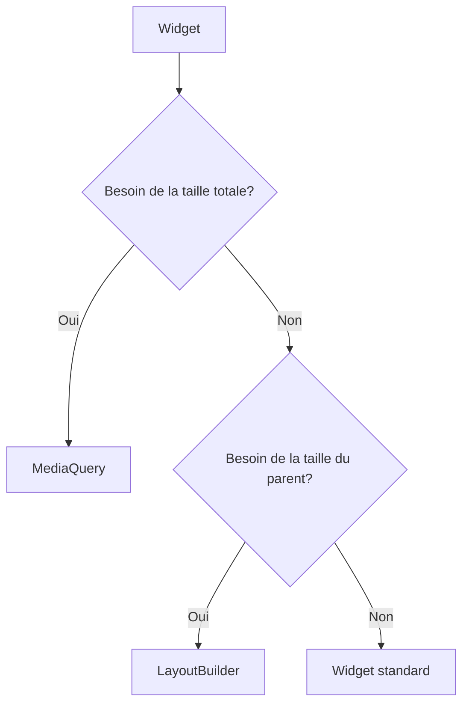

# 9-1-2 Responsive Design : LayoutBuilder et MediaQuery

Le responsive design consiste à adapter l'interface utilisateur aux différentes tailles d'écran (mobiles, tablettes, ordinateurs). Flutter propose deux outils principaux pour gérer cette adaptabilité.

## 1. Concepts fondamentaux
*   **MediaQuery :** Fournit des informations sur l'environnement global (taille de l'écran, orientation, densité de pixels).
*   **LayoutBuilder :** Fournit des informations sur les contraintes (largeur/hauteur) disponibles pour le widget lui-même au sein de l'arbre des widgets.

## 2. Fonctionnement détaillé

### MediaQuery
Utilisez `MediaQuery.of(context)` pour obtenir les dimensions totales de l'appareil.

```dart
final size = MediaQuery.of(context).size;
if (size.width < 600) {
  // Affichage mobile
} else {
  // Affichage tablette/desktop
}
```

### LayoutBuilder
Utilisez `LayoutBuilder` pour adapter un composant en fonction de l'espace qui lui est alloué par son parent.

```dart
LayoutBuilder(
  builder: (context, constraints) {
    if (constraints.maxWidth > 800) {
      return WideLayout();
    } else {
      return NarrowLayout();
    }
  },
)
```

## 3. Comparatif : MediaQuery vs LayoutBuilder

| Caractéristique | MediaQuery | LayoutBuilder |
| :--- | :--- | :--- |
| **Portée** | Écran entier | Widget parent uniquement |
| **Usage** | Décisions globales (ex: navigation) | Adaptabilité locale (ex: colonnes) |
| **Performance** | Déclenche un rebuild si l'écran change | Déclenche un rebuild si le parent change |

## 4. Cas d'usage
*   **Navigation :** Afficher une `BottomNavigationBar` sur mobile et un `NavigationRail` sur desktop.
*   **Grilles :** Ajuster le nombre de colonnes d'une `GridView` selon la largeur disponible.
*   **Typographie :** Réduire la taille des polices sur les petits écrans.

## 5. Bonnes pratiques professionnelles
*   **Approche "Mobile First" :** Concevez d'abord pour les petits écrans, puis ajoutez des éléments pour les grands écrans.
*   **Points de rupture (Breakpoints) :** Définissez des constantes pour vos seuils (ex: `mobile: 600`, `tablet: 900`).
*   **Utilisation ciblée :** Préférez `LayoutBuilder` pour les composants réutilisables, car il rend le widget indépendant de la taille totale de l'écran.

## 6. Erreurs fréquentes et points de vigilance
*   **Dépendance excessive à MediaQuery :** Utiliser `MediaQuery` partout rend les widgets difficiles à tester et à réutiliser dans des parties spécifiques de l'application.
*   **Ignorer l'orientation :** N'oubliez pas de vérifier `MediaQuery.of(context).orientation` pour gérer le passage du mode portrait au mode paysage.
*   **Rebuilds inutiles :** `MediaQuery` peut provoquer des rebuilds fréquents. Utilisez-le uniquement là où c'est nécessaire.

## 7. Flux de décision responsive



## 8. Recommandations actuelles
Pour des projets complexes, envisagez d'utiliser des packages comme `responsive_framework` ou `flutter_adaptive_scaffold` qui standardisent la gestion des breakpoints et simplifient la création d'interfaces adaptatives.

## Sources
*   [Flutter Documentation - Creating responsive apps](https://docs.flutter.dev/ui/layout/adaptive-responsive)
*   [Flutter API - MediaQuery](https://api.flutter.dev/flutter/widgets/MediaQuery-class.html)
*   [Flutter API - LayoutBuilder](https://api.flutter.dev/flutter/widgets/LayoutBuilder-class.html)