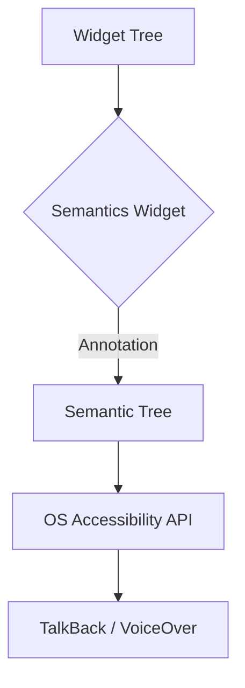

# 9-1-3 Accessibilité : Sémantique et lecteurs d'écran

L'accessibilité (a11y) garantit que les applications sont utilisables par tous, y compris les personnes souffrant de handicaps visuels, moteurs ou cognitifs. Flutter fournit une couche sémantique pour communiquer avec les technologies d'assistance (TalkBack sur Android, VoiceOver sur iOS).

## 1. Concepts fondamentaux
*   **Arbre sémantique :** Une représentation simplifiée de l'interface que les lecteurs d'écran utilisent pour décrire le contenu à l'utilisateur.
*   **Semantics Widget :** Le composant principal permettant d'annoter ou de masquer des éléments de l'interface.
*   **Lecteur d'écran :** Logiciel qui lit à haute voix le contenu textuel et les actions possibles sur l'écran.

## 2. Fonctionnement détaillé
Flutter génère automatiquement une sémantique de base pour les widgets standards (boutons, champs de texte). Pour les composants personnalisés, vous devez intervenir manuellement.

### Annotation simple
```dart
Semantics(
  label: 'Valider le formulaire',
  button: true,
  child: IconButton(
    icon: Icon(Icons.check),
    onPressed: () {},
  ),
)
```

### Masquage d'éléments décoratifs
Pour éviter que le lecteur d'écran ne lise des éléments purement visuels (ex: une icône décorative), utilisez `excludeSemantics` :

```dart
Semantics(
  excludeSemantics: true,
  child: Icon(Icons.star),
)
```

## 3. Bonnes pratiques professionnelles
*   **Contraste des couleurs :** Respectez les ratios de contraste définis par les normes WCAG (Web Content Accessibility Guidelines).
*   **Cibles tactiles :** Assurez-vous que les zones cliquables mesurent au moins 48x48 pixels pour faciliter la navigation.
*   **Hiérarchie :** Utilisez des titres et des libellés clairs pour permettre aux utilisateurs de naviguer rapidement dans l'application.
*   **Tests :** Testez systématiquement votre application avec TalkBack (Android) ou VoiceOver (iOS) activé.

## 4. Erreurs fréquentes et points de vigilance
*   **Libellés vagues :** Évitez les libellés comme "Bouton" ou "Image". Préférez "Valider la commande" ou "Photo du profil utilisateur".
*   **Ordre de lecture :** L'ordre de lecture par défaut suit l'ordre des widgets dans l'arbre. Si l'ordre visuel diffère, utilisez `Semantics` pour réorganiser la lecture.
*   **Oubli des états :** Si un bouton est désactivé, assurez-vous que le lecteur d'écran l'annonce explicitement.

## 5. Comparatif : Widgets standards vs Personnalisés

| Élément | Sémantique automatique | Action requise |
| :--- | :--- | :--- |
| `ElevatedButton` | Oui | Aucune |
| `TextField` | Oui | Ajouter un `hintText` |
| `Container` (cliquable) | Non | Envelopper dans `Semantics` |
| Icône décorative | Non | `excludeSemantics: true` |

## 6. Flux de traitement sémantique



## 7. Recommandations actuelles
Utilisez l'outil **Semantics Debugger** de Flutter (accessible via `showSemanticsDebugger: true` dans `MaterialApp`) pour visualiser comment votre application est interprétée par les lecteurs d'écran. Cela permet d'identifier immédiatement les zones manquantes ou mal étiquetées.

## Sources
*   [Flutter Documentation - Accessibility](https://docs.flutter.dev/ui/accessibility)
*   [W3C - Web Content Accessibility Guidelines (WCAG)](https://www.w3.org/WAI/standards-guidelines/wcag/)